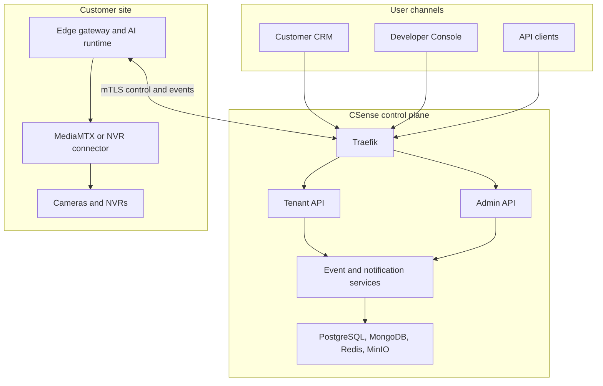
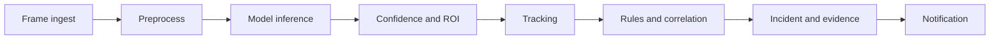

# Technical Requirements Document

## AIRIVU CSense Enterprise AI Video Analytics Platform

**Version:** 1.0  
**Status:** Implementation baseline  
**Date:** 19 August 2026  
**Related:** [PRD](01_PRODUCT_REQUIREMENTS_DOCUMENT.md) · [Flows](03_APPLICATION_FLOWS.md) · [Schema](05_BACKEND_SCHEMA.md) · [Plan](06_IMPLEMENTATION_PLAN.md)

---

## 1. Purpose

This document defines the target engineering architecture for modernizing CSense while preserving validated legacy capabilities. It specifies service boundaries, contracts, storage responsibilities, security controls, edge and camera behavior, AI orchestration, observability, deployment profiles, recovery, and migration.

## 2. Architecture Principles

1. **Tenant boundary everywhere:** identity, authorization, data, events, cache keys, objects, logs, and metrics must preserve tenant context.
2. **Separate control planes:** customer operations and platform operations have separate applications, APIs, permissions, and security policies.
3. **Edge-first media:** perform continuous inference near cameras when possible; send only required metadata and policy-approved evidence centrally.
4. **API-first and event-assisted:** synchronous APIs manage intent; durable events propagate state and workload.
5. **Immutable deployment assets:** model artifacts and published pipeline versions never change in place.
6. **Least privilege and auditable elevation:** privileged access is explicit, time-limited, and visible.
7. **Simple before distributed:** start with modular services and Compose; split or orchestrate only where scale or availability demands it.
8. **Outbox before dual writes:** state change and event intent are committed together.
9. **Fail safe:** deny ambiguous authorization, expired licenses, invalid configurations, and unverified devices.
10. **Observable by design:** every request, event, pipeline run, notification, and deployment carries correlation and health signals.

## 3. Source Baseline and Target Decision

### 3.1 Preserved legacy capabilities

- FastAPI APIs and WebSocket alerting
- React customer UI behavior
- RTSP and NVR ingestion
- ONVIF discovery
- Custom DDNS compatibility
- Go/Python edge agent concepts
- YOLO/ONNX detection models
- Fall, fire/smoke, ANPR, kitchen safety, restricted-zone, pose, and general detection pipelines
- Snapshots and real-time alert delivery
- Cloud-and-edge operation

### 3.2 Replaced or modernized patterns

| Legacy pattern | Target pattern |
|---|---|
| Nginx virtual hosts | Traefik v3 ingress and middleware |
| PM2 processes | Containerized services with health checks |
| Single React SPA | Separate Next.js Developer Console and React/Vite Customer CRM |
| Shared backend | Separate Admin API and Tenant API with shared internal libraries |
| SQLite auth/fallback | PostgreSQL system of record |
| Local snapshots | MinIO-compatible object storage |
| Custom RTSP/HLS manager | MediaMTX with signed session mediation |
| Direct database/event coupling | PostgreSQL outbox + Redis Streams/Pub/Sub |
| Ad hoc model configuration | Registry, immutable versions, validation, promotion, canary, rollback |
| Static privileged access | MFA, fine permissions, JIT support grants, complete audit |

### 3.3 Technology decision

FastAPI + Next.js/React is the approved application baseline. The modernization brief's Rust + Angular suggestion is treated as an earlier option. Rust may be used later for a profiled edge/media hot path through an architecture decision record. Angular is not introduced into release one because it would duplicate frontend frameworks without a demonstrated product benefit.

## 4. Target Context



## 5. Logical Services

Release one may deploy some services together while preserving the following logical boundaries.

| Service | Primary responsibility | Stack | Authoritative stores |
|---|---|---|---|
| Traefik | TLS, routing, security headers, request limits | Traefik v3 | Static/dynamic config |
| Identity Service | Login, MFA, sessions, invitations, service identities | FastAPI | PostgreSQL, Redis |
| Tenant API | Tenant-scoped CRUD, incidents, reports, WebSockets | FastAPI | PostgreSQL, MongoDB, Redis, MinIO |
| Admin API | Platform, reseller, license, model, pipeline, audit, support operations | FastAPI | PostgreSQL, MongoDB, Redis, MinIO |
| License Service | Entitlement resolution, quota reservation, metering | FastAPI module/service | PostgreSQL, Redis |
| Device Control Service | Edge enrollment, desired state, commands, heartbeat | FastAPI/async worker | PostgreSQL, MongoDB, Redis |
| Media Session Service | Authorize and broker WebRTC/HLS sessions | FastAPI + MediaMTX | Redis, PostgreSQL |
| AI Orchestrator | Model/pipeline deployment, assignment, rollout, status | FastAPI + workers | PostgreSQL, Redis, MinIO |
| AI Runtime | Frame ingest, preprocess, infer, filter, track, rules | Python asyncio, YOLO/ONNX | Redis, local edge cache |
| Incident Service | Correlation, suppression, lifecycle, evidence links | FastAPI/worker | PostgreSQL, MongoDB, MinIO |
| Notification Service | Policy evaluation, templating, provider delivery/retry | Worker service | PostgreSQL, Redis |
| Webhook Service | Signed outbound delivery and retry | Worker service | PostgreSQL, Redis |
| Audit Service | Append audit events, query index, integrity chain/export | Shared library + worker | PostgreSQL, MinIO archive |
| Export Service | Asynchronous reports and evidence exports | Worker service | PostgreSQL, MongoDB, MinIO |
| Developer Console | Platform operations UI | Next.js 14 | APIs only |
| Customer CRM | Tenant operations UI | React 18 + Vite | APIs only |
| Observability | Metrics, logs, traces, alerts, dashboards | Prometheus/Grafana/Loki/Tempo or equivalent | Monitoring storage |

## 6. Application Separation

### 6.1 Customer CRM

- Separate origin such as `app.<domain>`.
- Calls only tenant/public identity APIs.
- Token audience `csense-customer`.
- Tenant and site scope derived from authenticated membership.
- No cross-tenant search, model artifact upload, provider credentials, deployment controls, or infrastructure logs.

### 6.2 Developer Console

- Separate origin such as `console.<domain>`.
- Calls only admin/operator APIs.
- Token audience `csense-platform`.
- Mandatory MFA and stronger session risk controls.
- Cross-tenant access requires an explicit permission and, for sensitive data, a just-in-time support grant.
- Sensitive mutations support step-up authentication and approval policy.

### 6.3 API gateway rules

- `/api/v1/tenant/**` routes to Tenant API.
- `/api/v1/admin/**` routes to Admin API.
- `/api/v1/auth/**` routes to Identity Service with audience-aware flows.
- `/ws/v1/tenant` routes to tenant WebSocket gateway.
- `/edge/v1/**` requires device mTLS and device identity.
- `/media/**` accepts only short-lived signed session tokens.
- OpenAPI documents are separate for customer, platform, edge, and public integration APIs.

## 7. Identity and Security Architecture

### 7.1 Authentication

- Passwords: Argon2id with centrally configurable parameters; minimum baseline time cost 3 and memory cost 64 MB, reviewed annually.
- Access tokens: asymmetric JWT, 10–15 minute lifetime, issuer/audience/key ID, tenant membership reference, role/permission claims kept compact.
- Refresh sessions: opaque rotating token in secure HTTP-only SameSite cookie; only a keyed hash is stored in Redis/PostgreSQL.
- Replay response: revoke session family, flag security event, require reauthentication.
- MFA: WebAuthn/passkeys preferred; TOTP supported; recovery codes single-use and hashed.
- Device identity: bootstrap token only enrolls; enrolled device receives certificate and rotates it before expiry.
- API clients: client credentials or signed API key model; secret displayed once and stored hashed.

### 7.2 Authorization

Authorization evaluates:

`authenticated identity + token audience + active membership + role permissions + resource scope + support grant + tenant state + license entitlement + contextual policy`

The backend must not authorize from a client-supplied `tenant_id`. Repository functions require an injected `TenantContext`. Platform queries use a separate privileged repository interface and cannot be reached from tenant API code paths.

### 7.3 Permission model

Permission names follow `resource.action`, for example:

- `camera.read`, `camera.create`, `camera.credentials.rotate`
- `incident.read`, `incident.acknowledge`, `incident.close`, `evidence.download`
- `pipeline.assign`, `pipeline.publish`, `model.promote`
- `tenant.user.manage`, `license.manage`, `audit.export`
- `support.request`, `support.access`, `security.policy.manage`

Roles are permission bundles. Memberships additionally carry site/camera-group scopes. Deny wins when policy conflicts.

### 7.4 Security requirements

| ID | Requirement |
|---|---|
| TRD-SEC-001 | Every externally reachable endpoint shall have explicit authentication policy or documented public status. |
| TRD-SEC-002 | Tenant repositories shall apply PostgreSQL row-level security and application-level tenant predicates. |
| TRD-SEC-003 | Secrets shall be stored in a managed secret store or sealed deployment secret, never in source, logs, or client configuration. |
| TRD-SEC-004 | Camera credentials shall be envelope-encrypted with per-tenant or per-secret data keys. |
| TRD-SEC-005 | Sensitive logs and audit payloads shall redact tokens, passwords, camera URLs, provider secrets, and regulated identifiers. |
| TRD-SEC-006 | CSRF protection applies to cookie-authenticated mutations; CORS is allow-list based per application origin. |
| TRD-SEC-007 | Uploads shall be type/size validated, malware scanned, stored outside executable paths, and addressed by digest. |
| TRD-SEC-008 | Containers run non-root, use read-only filesystems where possible, drop capabilities, and use signed/scanned images. |
| TRD-SEC-009 | Production databases and object storage are not directly exposed to public or host networks. |
| TRD-SEC-010 | High-risk actions require recent MFA/step-up and create a security audit event. |

## 8. Multi-Tenant Architecture

### 8.1 Isolation model

Release one uses a shared PostgreSQL cluster/schema with mandatory `tenant_id`, row-level security, tenant-aware repositories, and negative isolation tests. Large/regulatory tenants may later use dedicated databases through the same repository contract.

MongoDB documents include `tenant_id` and compound indexes beginning with `tenant_id`. All collections use a tenant-filtering data access wrapper. Redis and MinIO keys include a canonical tenant prefix. Event envelopes always include tenant identity.

### 8.2 Reseller relationship

A reseller is an organization with reseller entitlements. Child tenants remain independent tenant boundaries. Reseller aggregate views are computed from authorized child relationships; records are not stored in a shared reseller tenant.

### 8.3 Isolation verification

- Static repository lint for tenant-aware methods
- Integration tests that swap valid object IDs across tenants
- RLS tests with direct SQL sessions
- WebSocket subscription isolation tests
- Redis key and event consumer tenant checks
- MinIO object authorization tests
- Export and search isolation tests

## 9. Licensing and Quota Enforcement

The license service resolves an effective entitlement document from plan, license instance, overrides, dates, suspension state, and reseller allocation.

For concurrent resource creation:

1. Begin database transaction.
2. Lock the relevant quota ledger row or use a serialized reservation function.
3. Verify active entitlement and available quantity.
4. Reserve/increment use.
5. Create the resource.
6. Commit resource, usage ledger, audit, and outbox together.

API and event metering may use Redis counters for speed but is reconciled to PostgreSQL usage buckets. Feature flags are not a substitute for license authorization.

## 10. API Architecture

### 10.1 Standards

- Base path `/api/v1` with URI major versioning.
- OpenAPI 3.1 generated and reviewed in CI.
- JSON request/response using snake_case fields.
- Cursor pagination for high-volume resources.
- RFC 3339 UTC timestamps.
- Idempotency key required for retryable external mutations.
- `X-Correlation-ID` accepted or generated and returned.
- Stable problem response: `code`, `message`, `details`, `correlation_id`, `retryable`.
- Optimistic concurrency through version/ETag for mutable configuration.
- Rate-limit headers and `Retry-After` where applicable.

### 10.2 Representative endpoints

```text
POST   /api/v1/auth/login
POST   /api/v1/auth/mfa/verify
POST   /api/v1/auth/refresh
DELETE /api/v1/auth/sessions/{session_id}

GET    /api/v1/tenant/dashboard
GET    /api/v1/tenant/sites
POST   /api/v1/tenant/cameras
POST   /api/v1/tenant/edge-devices/enrollment-tokens
POST   /api/v1/tenant/cameras/{id}/pipeline-assignments
GET    /api/v1/tenant/incidents
POST   /api/v1/tenant/incidents/{id}/acknowledge
POST   /api/v1/tenant/incidents/{id}/resolve
POST   /api/v1/tenant/media/sessions
POST   /api/v1/tenant/webhooks

POST   /api/v1/admin/organizations
POST   /api/v1/admin/licenses
POST   /api/v1/admin/support-grants
POST   /api/v1/admin/models
POST   /api/v1/admin/models/{id}/versions
POST   /api/v1/admin/model-versions/{id}/promote
POST   /api/v1/admin/pipelines
POST   /api/v1/admin/pipeline-versions/{id}/deployments
POST   /api/v1/admin/deployments/{id}/rollback
GET    /api/v1/admin/audit-events

POST   /edge/v1/enroll
POST   /edge/v1/heartbeat
GET    /edge/v1/desired-state
POST   /edge/v1/events:batch
POST   /edge/v1/command-results
```

## 11. Event-Driven Architecture

### 11.1 Event envelope

```json
{
  "event_id": "uuid",
  "event_type": "incident.created.v1",
  "occurred_at": "2026-08-19T10:00:00Z",
  "producer": "incident-service",
  "tenant_id": "uuid",
  "site_id": "uuid",
  "subject_id": "uuid",
  "correlation_id": "uuid",
  "causation_id": "uuid",
  "schema_version": 1,
  "data": {}
}
```

### 11.2 Transport selection

- PostgreSQL transactional outbox guarantees event intent for business mutations.
- Redis Streams handles durable near-real-time work queues at initial scale.
- Redis Pub/Sub supports ephemeral UI fan-out after durable persistence.
- WebSockets deliver scoped UI updates.
- Kafka/NATS is an optional future replacement when retention, replay, throughput, or consumer count exceeds Redis Streams operating limits.

### 11.3 Consumer rules

- At-least-once delivery is assumed.
- Consumers deduplicate by `event_id` or domain idempotency key.
- Poison messages move to a dead-letter stream with alerting.
- Event schema changes are backward compatible within a major version.
- Consumers verify tenant and resource scope before processing.

## 12. Edge Architecture

### 12.1 Edge components

- Device agent and secure updater
- Camera/NVR discovery and credential broker
- Media ingestion and decode
- AI runtime and pipeline executor
- Local configuration/cache database
- Encrypted event/evidence spool
- Health and resource telemetry
- Command executor
- WireGuard/relay client for approved connectivity

### 12.2 Device lifecycle

`manufactured/registered → bootstrap issued → enrolled → active → degraded/offline → quarantined → retired`

The control plane stores desired state. The device reports observed state and version. Commands are signed/scoped, expire, have idempotency keys, and return result records.

### 12.3 Offline behavior

- Continue last known valid pipelines until policy expiry.
- Store detection events and selected evidence in an encrypted bounded spool.
- Preserve source capture time and monotonic sequence.
- Apply retention/priority eviction only according to tenant policy.
- Reconnect with exponential backoff and jitter.
- Upload in order where causality matters; deduplicate centrally.
- Do not accept expired new commands while offline.

### 12.4 Edge security

- Secure boot and TPM-backed keys preferred for managed appliances.
- Mutual TLS, certificate rotation, and revocation.
- Signed edge software and model manifests.
- Model artifact digest verification before activation.
- Local secrets encrypted and never written to diagnostic bundles.
- Remote shell disabled by default; support tunnels are time-limited and audited.

## 13. Camera Connectivity and DDNS

### 13.1 Supported paths

1. Edge → camera direct RTSP/ONVIF on local network.
2. Edge → NVR channel through vendor-neutral or certified adapter.
3. Edge → WireGuard private network.
4. Edge/cloud → controlled relay for live view/support.
5. Legacy DDNS endpoint during migration through a compatibility adapter.
6. Temporary direct connectivity only when explicitly authorized.

### 13.2 Camera rules

- Probe and validate without storing plaintext secrets in logs.
- Normalize RTSP URIs and keep credentials in a separate encrypted secret record.
- Record primary/sub-stream profiles, codecs, resolution, FPS, time offset, and capabilities.
- Use sub-stream for inference where appropriate and main stream for evidence/live view by policy.
- Apply connection pooling, bounded reconnect, circuit breakers, and vendor-specific timeouts.
- Never make camera ports public merely for platform convenience.

## 14. Media Architecture

MediaMTX terminates or relays RTSP and exposes WebRTC/HLS through authorized paths. The Media Session Service issues a short-lived token after checking membership, scope, camera status, privacy policy, and license. Live media is not routed through Tenant API processes.

Snapshots and clips are written to object storage with tenant-prefixed keys. Metadata and authorization remain in application stores. Lifecycle rules delete objects only after retention and legal-hold checks.

## 15. AI Model Architecture

### 15.1 Registry entities

- Model family and task
- Immutable model version
- Artifact digest and object path
- Framework/runtime compatibility
- Input/output schema and label map
- Hardware profile
- License/provenance
- Validation suite and results
- Environment promotion state
- Deprecation/revocation state

### 15.2 Validation gates

1. File integrity, malware, and license scan
2. Load/shape compatibility
3. Golden dataset functional tests
4. Accuracy metrics against declared thresholds
5. Latency, throughput, RAM/VRAM, and thermal profile
6. Adversarial and malformed-input behavior
7. Edge hardware compatibility
8. Privacy and use-case approval
9. Signed release manifest

Production promotion creates an auditable deployment intent. Artifacts are content-addressed and cannot be overwritten.

## 16. AI Pipeline Architecture



Pipeline definitions are JSON documents validated against a versioned schema. A published version references exact stage types, model versions, parameters, permitted tenant overrides, target runtime, and resource profile.

Runtime configuration uses a three-layer cache:

1. In-process active config
2. Redis distributed cache/invalidation
3. PostgreSQL authoritative version

Deployment publishes `pipeline.assignment.changed.v1`. A runtime activates only after verifying schema, artifact digests, hardware capacity, and effective time. Canary comparison monitors event rate, latency, error rate, resource use, and sample outcomes before expansion.

## 17. Detection, Incident, and Evidence Architecture

- A **detection** is an immutable observation generated by a pipeline.
- An **incident** is a tenant business case derived from one or more detections or manual input.
- **Evidence** is an authorized metadata record referencing immutable or retention-managed media.

Rules support time windows, ROI, schedules, threshold duration, object tracking, cooldown, duplicate suppression, and correlation keys. Incident state transitions use a state machine and append-only history. Evidence objects store SHA-256 digest, capture time, ingestion time, camera, model, pipeline, retention class, and legal-hold state.

## 18. Notification Architecture

The Notification Service consumes incident and system events, evaluates tenant policies, expands recipient groups, creates notification records, and schedules delivery attempts.

Provider adapters implement a common interface for in-app, web push, email, SMS, and webhooks. Retries use exponential backoff with channel-specific limits. Permanent failures do not block incident processing. Acknowledgement may cancel pending escalation steps according to policy.

Templates are versioned, localized where required, and rendered from an allow-listed data model. Webhooks use timestamped HMAC signatures, unique delivery IDs, replay windows, and secret rotation.

## 19. Audit Architecture

Audit events are written through a shared audit library and transactional outbox. Each event includes actor type/id, represented actor if any, tenant, action, target, outcome, source IP/device/session, correlation, purpose/support grant, and redacted before/after patches.

High-value event batches are hash chained and periodically signed/anchored to immutable object storage. Operational queries use PostgreSQL indexes; older records may be archived to MinIO while retaining searchable manifests.

## 20. Reporting and Export

Interactive dashboards query bounded aggregates and indexed operational data. Large reports are asynchronous jobs:

`request → authorize → snapshot query criteria → enqueue → generate → scan → store → notify → expire`

Exports carry tenant scope, requester, query criteria, generated time, checksum, retention, and one-time or expiring download authorization.

## 21. Data Architecture

| Data class | Store | Reason |
|---|---|---|
| Identity, tenancy, roles, licenses | PostgreSQL | Transactions, constraints, RLS |
| Sites, cameras, configuration, assignments | PostgreSQL | Consistency and versioning |
| Incidents and workflow history | PostgreSQL | Transactional state and reporting |
| High-volume detections and telemetry | MongoDB | Flexible event payload and write volume |
| Sessions, cache, streams, counters | Redis | Low latency and coordination |
| Snapshots, clips, model artifacts, exports, backups | MinIO | Scalable object lifecycle |

Detailed fields and indexes are defined in the [Backend Schema](05_BACKEND_SCHEMA.md).

### 21.1 Data requirements

| ID | Requirement |
|---|---|
| TRD-DATA-001 | PostgreSQL migrations shall be forward-only in production and include tested rollback/compatibility strategy. |
| TRD-DATA-002 | Cross-store operations shall use IDs and events; application code shall not assume distributed transactions. |
| TRD-DATA-003 | Delete workflows shall honor retention, legal hold, reseller relationship, and audit requirements. |
| TRD-DATA-004 | Every object and document shall be addressable to one tenant or explicitly classified as platform-global. |
| TRD-DATA-005 | Timestamps shall distinguish source capture, edge receive, cloud receive, processing, and persisted time where relevant. |

## 22. Observability

### 22.1 Signals

- Metrics: RED for APIs, USE for infrastructure, AI throughput/latency, camera health, queue lag, notification results, license denials.
- Logs: structured JSON with environment, service, version, tenant pseudonymous ID, correlation ID, trace ID, severity, and redaction.
- Traces: ingress through API, outbox, worker, notification, and storage calls.
- Synthetic probes: login, API health, WebSocket, media session, event-to-alert path.

### 22.2 SLOs and alerts

| SLI | Initial objective |
|---|---|
| Customer API availability | 99.9% monthly after stabilization |
| p95 control API latency | <500 ms reads, <1 s mutations |
| Accepted detection to WebSocket publish | p95 <5 s |
| Edge desired-state convergence | 99% online devices within 60 s |
| Notification queue age | p95 <30 s for high severity |
| Backup job success | 100% scheduled jobs; failure alerts immediately |

Alerts must be actionable, routed by ownership, deduplicated, and linked to runbooks. Tenant evidence and secrets are prohibited in observability payloads.

## 23. Deployment Architecture

### 23.1 Profiles

| Profile | Intended use | Orchestration |
|---|---|---|
| Local | Developer and automated integration | Docker Compose |
| Pilot/small production | Single-node or controlled VM deployment | Hardened Docker Compose |
| Enterprise | Multi-node HA and independent scaling | Kubernetes |
| On-prem control plane | Customer-owned environment | Compose or Kubernetes based on SLA |
| Edge | Site appliance | Signed container/system services with watchdog |

### 23.2 Kubernetes trigger

Adopt Kubernetes when at least one applies: multi-node HA is contractually required; sustained scale exceeds a single host safety margin; independent GPU pools are needed; multiple regions/clusters are required; or release frequency/operations make manual host coordination unsafe.

### 23.3 CI/CD

Pipeline stages:

`format/lint → unit → contract → dependency/secret scan → build → SBOM/sign → integration → tenant isolation → AI validation → DAST → load/smoke → staging deploy → canary → production approval → post-deploy verification`

Database expand/migrate/contract changes remain backward compatible across a rolling deployment. Every production release has an immutable manifest and rollback/forward-fix path.

### 23.4 Operations requirements

| ID | Requirement |
|---|---|
| TRD-OPS-001 | Every service shall expose liveness, readiness, version, and dependency health without leaking secrets. |
| TRD-OPS-002 | Infrastructure shall be reproducible through version-controlled IaC. |
| TRD-OPS-003 | Production deployments shall use canary or blue/green controls for APIs, AI pipelines, and edge updates. |
| TRD-OPS-004 | Backups shall be encrypted, integrity-checked, retention-managed, and restore-tested quarterly. |
| TRD-OPS-005 | Release rollback shall not depend on reversing an incompatible destructive schema migration. |

## 24. Backup and Disaster Recovery

- PostgreSQL: continuous WAL/archive or managed PITR plus daily logical/custom-format backup.
- MongoDB: replica-consistent backup with oplog/PITR where supported.
- MinIO: versioning, replication or off-site copy for critical buckets.
- Redis: not treated as sole source of truth; persistence configured for streams and recoverable coordination where required.
- Secrets/config: backed up through approved secret/IaC systems.
- Edge: bounded encrypted local spool and recoverable desired state.

Production target: control-data RPO ≤15 minutes and RTO ≤4 hours. A restore exercise must reconstruct a clean environment, restore stores, verify cross-store references, rotate affected secrets, and run application smoke tests.

## 25. Performance and Capacity

Initial capacity targets are design inputs, not promises until pilot benchmarking:

- 5,000 managed cameras across 100 tenants
- 1,000 detections/second burst and 200/second sustained centrally accepted event rate
- 500 concurrent interactive users
- 2,000 concurrent WebSocket subscriptions
- 100 concurrent live sessions depending on relay bandwidth
- AI edge sizing profiled by model, FPS, stream resolution, batching, hardware, and thermal conditions

Load tests must distinguish control API, event ingestion, WebSocket fan-out, media relay, object storage, and AI runtime. Raw video throughput is not mixed into ordinary API capacity figures.

## 26. Testing Strategy

- Unit tests for domain rules, policy, transformations, and adapters
- API contract tests generated from OpenAPI
- PostgreSQL RLS and tenant isolation tests
- Cross-store integration tests
- WebSocket authorization and reconnect tests
- Edge enrollment, offline spool, resync, update, and certificate rotation tests
- Camera lab tests against certified camera/NVR matrix
- Golden dataset AI regression tests
- Pipeline canary/rollback tests
- Notification provider sandbox and failure injection tests
- Backup/restore and regional failure exercises
- SAST, SCA, container/IaC scan, DAST, secret scan, and penetration tests
- Performance, endurance, spike, and queue backlog recovery tests

## 27. Migration Strategy

### 27.1 Sequence

1. Inventory legacy services, endpoints, databases, files, models, cameras, users, tenants, and agents.
2. Freeze ambiguous schemas and create mapping rules.
3. Introduce stable IDs and tenant ownership for all migrated records.
4. Deploy new stores and APIs in shadow/read-only mode.
5. Migrate passwords to Argon2id using forced reset where legacy integrity is uncertain.
6. Move snapshot files to MinIO and verify count, digest, metadata, and access policy.
7. Import sites, cameras, credentials through encryption pipeline, models, pipeline configurations, and incident history.
8. Deploy compatibility adapters for DDNS, edge protocol, and legacy APIs.
9. Dual-read or shadow-compare selected workflows; avoid uncontrolled dual-write.
10. Pilot tenant cutover, validate live streams, alerts, evidence, users, and reports.
11. Migrate in waves with rollback checkpoints.
12. Decommission legacy components only after retention, audit, and recovery verification.

### 27.2 Migration controls

- Dry run by default
- Idempotent import with source ID mapping
- Per-tenant reconciliation report
- Secret rotation after import where possible
- Evidence digest comparison
- Cutover change freeze and rollback window
- Legacy data read-only retention according to policy

## 28. Key Trade-offs

| Decision | Benefit | Cost/mitigation |
|---|---|---|
| PostgreSQL + MongoDB | Strong control-plane integrity plus flexible high-volume events | Cross-store consistency needs IDs, outbox, and reconciliation |
| Redis Streams initially | Low operational overhead and fits current stack | Define migration trigger for Kafka/NATS |
| Separate UIs and APIs | Stronger security and workflow clarity | Shared design tokens and generated clients prevent duplication |
| Edge-first inference | Lower bandwidth and better privacy/latency | Edge fleet/update complexity requires device control plane |
| Compose before Kubernetes | Faster pilot and lower operations burden | Keep containers/stateless services Kubernetes-ready |
| FastAPI/Python AI | Team and model ecosystem alignment | Profile hot paths; use native/runtime acceleration before adding Rust |

## 29. Architecture Acceptance Gates

- Threat model and data classification approved.
- Tenant isolation proven across PostgreSQL, MongoDB, Redis, MinIO, WebSockets, and exports.
- Device enrollment, certificate rotation, revocation, and offline resync demonstrated.
- Model/pipeline validation, canary, rollback, and provenance demonstrated.
- License quotas remain correct under concurrency and reseller allocation.
- Restore exercise meets RPO/RTO target.
- Legacy migration reconciliation passes for the pilot tenant.
- SLO dashboards and actionable alerts are active before production traffic.

