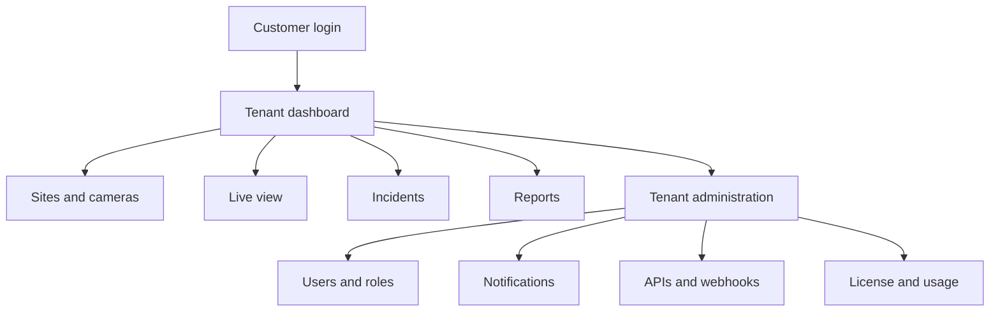
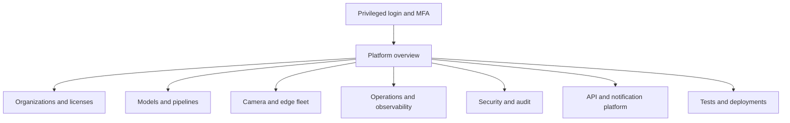
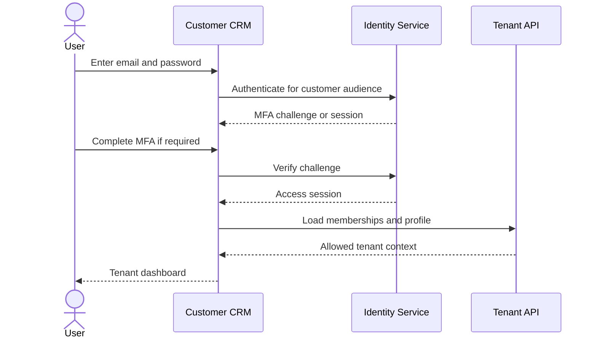
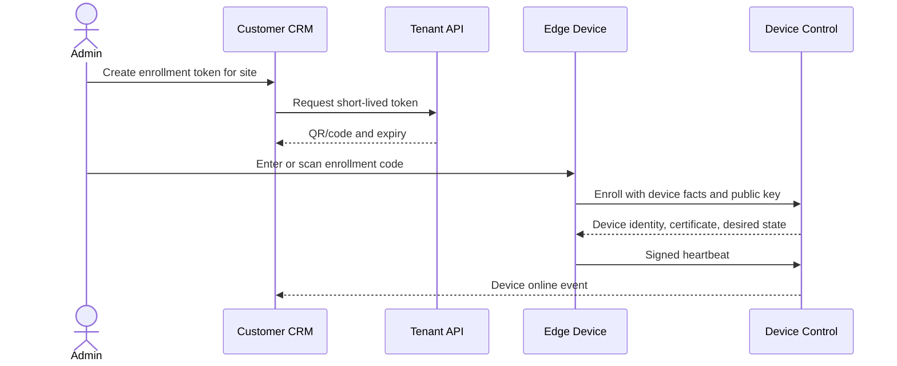
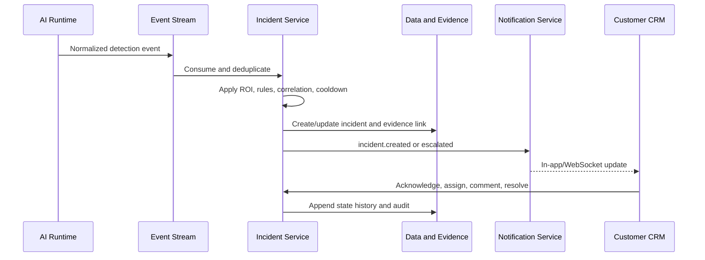
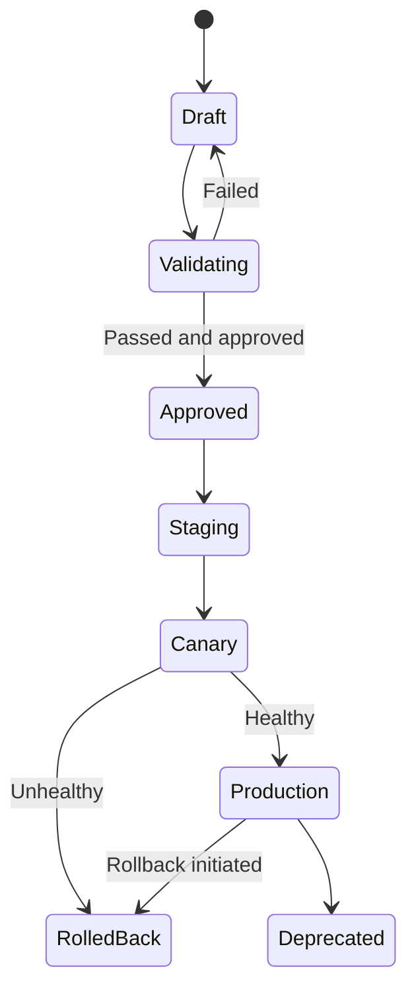
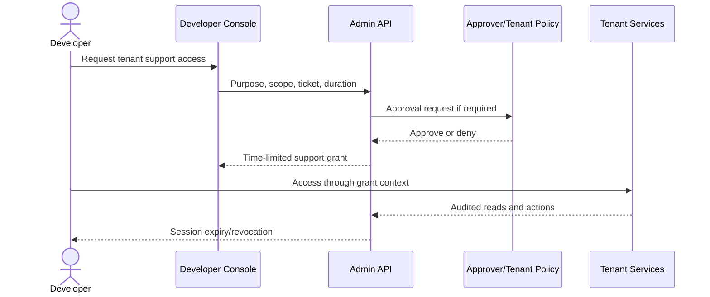

# Application Flows

## AIRIVU CSense Customer CRM and Developer Console

**Version:** 1.0  
**Date:** 19 August 2026  
**Related:** [PRD](01_PRODUCT_REQUIREMENTS_DOCUMENT.md) · [TRD](02_TECHNICAL_REQUIREMENTS_DOCUMENT.md) · [UI/UX Brief](04_UI_UX_DESIGN_BRIEF.md)

---

## 1. Flow Conventions

- Customer and operator workflows use separate authentication audiences and applications.
- Every tenant workflow assumes backend-derived tenant scope.
- Every mutation returns a correlation ID and creates an audit event where specified.
- Async activities show a durable job state rather than pretending to complete synchronously.
- Destructive, privileged, or externally visible operations require confirmation and may require step-up MFA.
- Empty, loading, partial, stale, offline, forbidden, quota-blocked, and failed states are first-class UI states.

## 2. Navigation Contexts

### 2.1 Customer CRM

### 2.2 Developer Console

## 3. FLOW-01: Customer Sign-in and Tenant Selection

**Actor:** Tenant user  
**Preconditions:** Active user, active organization membership, valid tenant state

Main path:

1. User opens the Customer CRM origin.
2. User submits email/password or passkey.
3. Identity Service evaluates rate limit, account state, password, risk, and MFA policy.
4. If MFA is required, the CRM presents the enrolled method without revealing account existence to unauthenticated attackers.
5. Identity Service issues customer-audience access and rotating refresh session.
6. If the user has one membership, it becomes active. If multiple, the user selects among authorized organizations.
7. CRM loads dashboard using the selected membership context.

Exceptions:

- Invalid credentials: generic error and attempt audit.
- Locked/suspended tenant: sign-in may complete, but a policy page explains restricted access.
- Expired invitation: user can request a fresh invitation.
- Recovery: verified recovery path, MFA reset approval, and session revocation.
- Developer credentials on customer origin: rejected due to audience separation.

## 4. FLOW-02: New Organization Onboarding

**Actors:** Principal Administrator, organization owner  
**Outcome:** Licensed, secured tenant ready for site onboarding

1. Principal Administrator selects **Create organization** in Developer Console.
2. Enters legal/display name, type (direct/reseller), region, owner email, term, plan, quotas, data retention, and required security policy.
3. Admin API validates uniqueness, reseller parent allocation, plan compatibility, and available platform region.
4. A single transaction creates organization, tenant, license, quota ledger, owner invitation, audit, and outbox event.
5. Owner receives a time-limited invitation.
6. Owner verifies email, sets password/passkey, enrolls MFA, accepts terms, and reviews privacy/retention settings.
7. Guided setup collects timezone, sites, notification contacts, and initial users.
8. Tenant status moves from `provisioning` to `active` after required checks.

Failure handling:

- Duplicate domain/name does not expose another tenant's details.
- Invitation delivery failure is visible to platform admin and retryable.
- Provisioning failure remains resumable; partially created resources are not hidden.
- License reservation rolls back if tenant creation fails.

## 5. FLOW-03: Reseller Creates a Child Tenant

**Actor:** Reseller Super Admin

1. Reseller opens **Customers → Add customer**.
2. UI shows remaining child tenants, cameras, users, storage, edge devices, and pipelines.
3. Reseller proposes child limits not exceeding its unallocated capacity.
4. Backend locks reseller allocation, verifies effective license, reserves quotas, creates child tenant, and records relationship.
5. Child owner is invited and completes normal onboarding.
6. Reseller sees aggregate health/usage but accesses child evidence only when its explicit permissions and support policy allow it.

Concurrent quota conflict: one request succeeds; the other receives `LICENSE_QUOTA_EXCEEDED` with refreshed remaining capacity.

## 6. FLOW-04: Edge Device Enrollment

**Actors:** Tenant Admin, installer, edge device

Rules:

- Token is single-use, short-lived, site-bound, and contains no permanent credential.
- Device presents hardware/software facts and a generated key.
- Control service validates quota and enrollment policy, then issues machine identity/certificate.
- Device downloads signed desired-state manifest.
- First heartbeat reports version, network, storage, CPU/GPU, time offset, and capabilities.
- Admin verifies device identity and assigns a friendly name.

Exceptions:

- Used/expired token: no enrollment; admin can create a replacement.
- Quota exhausted: enrollment is not partially created.
- Unsupported version: device is enrolled into `quarantined` state with upgrade instructions.
- Clock drift: certificate process uses tolerance, but device remains degraded until corrected.

## 7. FLOW-05: Camera Discovery and Onboarding

**Actors:** Tenant Admin, Edge Device

1. Admin opens a site and selects **Discover cameras**.
2. CRM checks edge online state and required permission.
3. Edge performs bounded ONVIF discovery on approved interfaces/subnets.
4. Results display vendor, model, address, profiles, and duplicate status without passwords.
5. Admin selects cameras, provides credentials or chooses an NVR credential set, and selects main/sub-stream profiles.
6. Edge validates connectivity, codec, resolution, FPS, time, and snapshot retrieval.
7. Backend encrypts credentials, creates camera records, consumes camera quota, and issues desired-state update.
8. Admin names cameras, assigns zones/groups, privacy mode, retention, and health alert policy.
9. Camera enters `ready` after stable probe; failures enter `attention_required` with reason.

Alternative paths:

- **Manual RTSP:** paste endpoint without embedding credentials; test and normalize.
- **NVR:** discover channels through adapter and add selected channels as cameras.
- **Legacy DDNS:** resolve through compatibility adapter and recommend edge migration.
- **WireGuard:** select approved private network route.

## 8. FLOW-06: Live View and Privacy Enforcement

1. User selects camera or saved multi-camera layout.
2. Tenant API checks membership, site scope, camera state, license, privacy policy, and live-view permission.
3. Media Session Service issues a short-lived media token and selects WebRTC, HLS fallback, or unavailable state.
4. MediaMTX establishes the session without revealing RTSP credentials.
5. CRM displays stream, camera health, latency, active pipeline badges, and privacy state.
6. If privacy masking/silhouette mode is mandatory, only the processed stream is authorized for the user.
7. Session ends on expiry, logout, permission change, camera disablement, or explicit close.

States:

- Live
- Reconnecting with bounded retry
- Edge offline but last snapshot available
- Camera credentials invalid
- Codec/browser unsupported with HLS fallback
- Privacy restricted
- Permission revoked
- Concurrent stream/license limit reached

## 9. FLOW-07: Detection to Incident Resolution

Operator interaction:

1. New incident appears in real time with severity, site, camera, use case, time, masked preview, and notification status.
2. Operator opens details and reviews evidence, timeline, related detections, and camera context.
3. Operator acknowledges with optional note; acknowledgement time is measured.
4. Operator assigns or escalates, adds comments, or marks false positive with reason.
5. Authorized user resolves with resolution category and summary.
6. Incident remains searchable according to retention; history is immutable.

Race rules:

- Version/ETag prevents silent overwrites.
- Duplicate detections update the same incident when correlation policy matches.
- Two acknowledgements are idempotent; first acknowledgement is retained and later action is recorded.

## 10. FLOW-08: Notification Policy and Escalation

1. Tenant Admin selects an event class and severity.
2. Builds recipient groups, active schedule, initial channels, escalation delays, acknowledgement behavior, and fallback.
3. **Simulate** shows example recipients and channels without sending.
4. Policy validation checks missing contacts, unavailable providers, quiet-hour conflicts, and circular escalation.
5. Admin publishes a new immutable policy version.
6. On incident event, Notification Service resolves the effective policy and creates scheduled steps.
7. Each provider attempt updates delivery state.
8. Acknowledgement cancels future steps when configured; otherwise escalation continues.
9. Permanent failures surface in tenant delivery history and platform provider operations.

## 11. FLOW-09: Model Registration and Promotion

**Actor:** AI Engineer in Developer Console

1. Create or select model family and task.
2. Upload artifact and metadata: framework, input shape, labels, model card, license, provenance, hardware targets.
3. Object storage computes digest; registry creates immutable version in `uploaded` state.
4. Automated gates scan artifact, load runtime, execute golden dataset, measure accuracy/performance, and generate evidence.
5. Engineer reviews failures or requests approval.
6. Authorized approver promotes to `staging`.
7. Staging deployment runs shadow/canary tests.
8. Production promotion requires successful gates, approval, signed manifest, and deployment window.
9. Model performance and health are monitored; an authorized operator may deprecate or revoke.

Rollback does not overwrite the bad version. It creates a deployment pointing to the last approved version and records reason/impact.

## 12. FLOW-10: Pipeline Build, Test, Deploy, and Roll Back

1. Engineer clones an existing pipeline or creates a draft.
2. Adds stages and exact model version, parameters, allowed tenant overrides, resource profile, and target runtime.
3. Schema/capability validation runs continuously.
4. Test runner executes recorded samples and expected outcomes.
5. Reviewer approves immutable version.
6. Deployment targets staging, selected edge cohort, or camera assignment.
7. Canary compares latency, errors, resource use, and event-rate deviation.
8. Healthy deployment expands by policy; unhealthy deployment pauses or rolls back.
9. Assignment event invalidates cache and devices converge to desired state.

## 13. FLOW-11: API Key and Webhook Setup

### API key

1. Tenant Super Admin chooses scopes, site restrictions, expiry, name, and rate policy.
2. Backend checks license/API entitlement and step-up authentication.
3. Secret is shown once; only a hash and prefix are retained.
4. Admin copies secret and tests through generated documentation.
5. Usage, last-used time, failures, rotation, and revocation are visible.

### Webhook

1. Admin enters HTTPS destination, event filters, and optional custom headers from an allow-list.
2. Platform sends a verification challenge.
3. On success, webhook becomes active.
4. Deliveries include event ID, timestamp, body, and HMAC signature.
5. Failed attempts retry and appear in history; admin can replay an eligible event using a new delivery ID.

## 14. FLOW-12: Developer Support Access to a Tenant

Rules:

- Search may show tenant operational summary, but evidence/personal data requires a support grant.
- Grant includes purpose, ticket, scopes, sites, start, expiry, and approver.
- UI displays a persistent support-session banner and remaining time.
- Read and mutation audits retain developer, represented context, tenant, and grant ID.
- Grant expires or can be revoked immediately; no refresh extends it automatically.
- Any impersonation uses a separate, clearly labeled mode and never exposes user credentials.

## 15. FLOW-13: Edge Offline and Resynchronization

1. Heartbeat misses threshold; control plane changes device to `degraded`, then `offline`.
2. Tenant dashboard marks affected cameras and optional notification policy fires.
3. Edge continues active valid pipeline and stores events/evidence in encrypted local spool.
4. Edge reconnects with backoff, authenticates certificate, and reports observed state plus last acknowledged sequence.
5. Control plane returns current desired-state version and upload cursor.
6. Edge uploads batches in sequence with idempotency keys.
7. Cloud deduplicates, records original capture time, and processes incidents according to late-event policy.
8. Edge applies newer configuration only after artifact verification.
9. Device returns to `online` when heartbeat, configuration, streams, and storage meet health policy.

Conflict policy:

- Cloud desired state wins for configuration.
- Edge original event identity/timestamps are preserved.
- Expired commands are not executed.
- Late events may create incidents but notification behavior follows tenant late-event rules.

## 16. FLOW-14: License Expiry, Grace, and Suspension

1. System emits renewal reminders at configured intervals.
2. On expiry, license moves to `grace` if defined.
3. During grace, existing safety processing may continue while new resources and nonessential features are blocked.
4. After grace, tenant moves to restricted/suspended mode according to commercial policy.
5. Evidence remains protected; administrators can access renewal and export paths permitted by policy.
6. Renewal creates a new term/history entry and recalculates entitlements.
7. Reactivation is audited and edge desired state is reconciled.

Safety behavior must be contractually defined; license expiry must not silently destroy evidence or corrupt device configuration.

## 17. FLOW-15: Report and Evidence Export

1. User selects report type, scope, date range, fields, format, and evidence inclusion.
2. Backend authorizes every scope and estimates size.
3. User confirms if export contains sensitive media.
4. Export job snapshots criteria and runs asynchronously.
5. Generator queries tenant-scoped data, creates file, computes checksum, scans output, and stores it.
6. User receives in-app/email notification with expiry.
7. Download requires current authorization and is audited.
8. Object expires automatically unless legal hold or policy extends it.

## 18. FLOW-16: Production Deployment

1. Release candidate passes code, contract, security, tenant isolation, migration, AI, and load gates.
2. Signed images and manifest are published.
3. Staging deploy runs migrations in expand-compatible mode and executes smoke tests.
4. Change owner reviews dashboards, known risks, rollback, and incident contacts.
5. Canary receives a bounded tenant/traffic percentage.
6. Automated comparison checks error budget, latency, queues, detection/notification path, and resource use.
7. Release expands or rolls back.
8. Post-deploy verification and audit evidence are attached to release record.
9. Contracting schema cleanup occurs only in a later compatible release.

## 19. Cross-Flow Error Codes

| Code | Meaning | UI response |
|---|---|---|
| `AUTH_MFA_REQUIRED` | Additional verification required | Open MFA flow without losing safe form context |
| `AUTH_STEP_UP_REQUIRED` | Recent MFA needed for sensitive action | Explain and resume after verification |
| `TENANT_SCOPE_DENIED` | Resource is outside authorized scope | Generic forbidden; do not reveal resource existence |
| `LICENSE_QUOTA_EXCEEDED` | Effective resource limit reached | Show limit, current use, and permitted next action |
| `RESOURCE_VERSION_CONFLICT` | Configuration changed elsewhere | Offer reload and compare; never silently overwrite |
| `EDGE_OFFLINE` | Command cannot currently reach device | Queue only if command type permits; show expiry |
| `CAMERA_STREAM_UNAVAILABLE` | Camera/NVR/media path failed | Show health reason and guided diagnostics |
| `PIPELINE_VALIDATION_FAILED` | Draft or deployment is invalid | Link to stage-specific test evidence |
| `PROVIDER_DELIVERY_FAILED` | Notification provider rejected/failed | Show retry/fallback status without secret details |
| `ASYNC_JOB_FAILED` | Export/test/deployment job failed | Show safe cause, correlation ID, and retry eligibility |

## 20. Flow Acceptance Checklist

- Customer and developer tokens cannot cross application APIs.
- Browser refresh and reconnect do not duplicate mutations or incidents.
- Every async flow has queued, running, succeeded, failed, cancelled, and expired states where applicable.
- Quota and authorization are rechecked server-side at commit time.
- All privileged flows capture purpose, actor, target, outcome, and correlation ID.
- UI never exposes camera credentials, API secret hashes, provider secrets, or unrestricted media/object URLs.
- Offline and late-event flows preserve original timestamps and idempotency.
- Every flow has accessible keyboard, focus, error, and confirmation behavior defined in the UI/UX brief.

