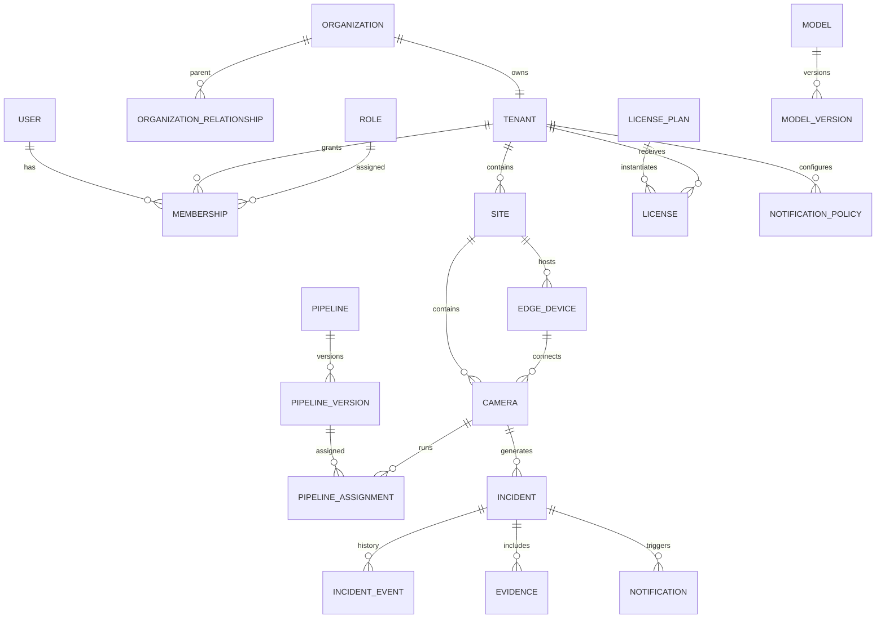

# Backend Schema

## AIRIVU CSense Data Model and Storage Contracts

**Version:** 1.0  
**Date:** 19 August 2026  
**Primary stores:** PostgreSQL 16, MongoDB 7, Redis 7, MinIO-compatible object storage

---

## 1. Scope and Rules

This schema is a logical implementation baseline. Exact SQL types, partitions, and indexes must be benchmarked before production, but entity ownership and isolation rules are mandatory.

Core rules:

1. UUIDv7 is preferred for new sortable identifiers; UUIDv4 is acceptable where libraries do not support v7.
2. All tenant-owned PostgreSQL tables include `tenant_id uuid not null` and row-level security.
3. Platform-global tables are explicitly identified and are inaccessible through tenant repositories.
4. `created_at`, `updated_at`, and event timestamps use `timestamptz` in UTC.
5. Mutable configuration carries `version bigint` for optimistic concurrency.
6. Secrets are stored in separate encrypted-secret records; business tables store only secret references.
7. Soft deletion uses `deleted_at` only where recovery/business history requires it. Evidence retention uses explicit lifecycle state.
8. Business mutations, audit intent, and outbox intent are committed in the same PostgreSQL transaction.
9. MongoDB, Redis, and MinIO are not trusted to infer tenant ownership from an opaque object ID.
10. Human-readable names are not global identifiers.

## 2. Store Responsibilities

| Store | Owns | Does not own |
|---|---|---|
| PostgreSQL | Identities, organizations, memberships, roles, licenses, sites, cameras, configuration, model/pipeline metadata, assignments, incidents, notification policy, jobs, audit index, outbox | Raw video, high-volume telemetry payloads, session secret material |
| MongoDB | Detection payloads, device/camera telemetry, AI runtime measurements, technical incident observations | Identity, authorization, license truth, mutable incident status |
| Redis | Refresh sessions, rate limits, quota fast counters, caches, streams, Pub/Sub, locks, short-lived media/support state | Sole authoritative business records |
| MinIO | Snapshots, clips, model artifacts, exports, diagnostic bundles, audit archives, backups | Authorization decisions or tenant membership |

## 3. High-Level Entity Model



## 4. Shared Column Standards

| Column | Type | Rule |
|---|---|---|
| `id` | `uuid` | Primary key; generated server-side |
| `tenant_id` | `uuid` | Required on tenant-owned records; first column in high-use compound indexes |
| `created_at` | `timestamptz` | Default `now()`; immutable |
| `created_by` | `uuid null` | Human/service identity reference when applicable |
| `updated_at` | `timestamptz` | Updated by application/trigger |
| `updated_by` | `uuid null` | Actor responsible |
| `version` | `bigint` | Starts at 1; increments on mutable update |
| `deleted_at` | `timestamptz null` | Only for approved recoverable deletion |
| `metadata` | `jsonb` | Bounded extension field; not a substitute for indexed domain columns |

## 5. Identity, Tenant, and Authorization Schema

### 5.1 `users` — platform-global identity

| Field | Type | Notes |
|---|---|---|
| `id` | uuid PK | User identity |
| `email_normalized` | citext unique | Lowercase canonical email |
| `email_display` | text | Original display form |
| `password_hash` | text null | Argon2id; null for external-only/passkey accounts |
| `status` | enum | invited, active, locked, disabled, deleted |
| `display_name` | text | Required |
| `locale` | text | Default locale |
| `timezone` | text | IANA timezone |
| `email_verified_at` | timestamptz null | Verification state |
| `last_login_at` | timestamptz null | Operational display only |
| `security_version` | bigint | Increment to revoke all token families |
| `created_at`, `updated_at` | timestamptz | Audit timestamps |

Indexes: unique email; `(status, updated_at)`.

### 5.2 `user_authenticators`

| Field | Type | Notes |
|---|---|---|
| `id` | uuid PK | Authenticator record |
| `user_id` | uuid FK | Owner |
| `type` | enum | webauthn, totp, recovery_code, oidc |
| `credential_id` | bytea/text null | WebAuthn/OIDC external ID |
| `secret_ciphertext` | bytea null | Envelope encrypted where needed |
| `public_key` | bytea null | WebAuthn public key |
| `counter` | bigint null | WebAuthn sign counter |
| `label` | text | User-friendly name |
| `enabled` | boolean | Active state |
| `last_used_at` | timestamptz null | Operational visibility |
| `created_at` | timestamptz | Timestamp |

Unique: `(user_id, type, credential_id)` where applicable.

### 5.3 `organizations`

| Field | Type | Notes |
|---|---|---|
| `id` | uuid PK | Commercial/legal organization |
| `organization_type` | enum | platform, direct_customer, reseller, reseller_customer |
| `legal_name` | text | Legal entity name |
| `display_name` | text | UI name |
| `slug` | citext unique | Human-friendly identifier |
| `status` | enum | provisioning, active, grace, suspended, closed |
| `billing_reference` | text null | External billing reference |
| `default_region` | text | Data/deployment region |
| `settings` | jsonb | Bounded organization-level settings |
| standard audit fields | | |

### 5.4 `tenants`

| Field | Type | Notes |
|---|---|---|
| `id` | uuid PK | Security/data boundary |
| `organization_id` | uuid unique FK | One primary tenant per customer organization in release one |
| `status` | enum | provisioning, active, restricted, suspended, closed |
| `data_region` | text | Residency region |
| `default_timezone` | text | IANA timezone |
| `retention_policy_id` | uuid null | Effective default retention |
| `security_policy_id` | uuid null | Effective tenant security policy |
| `settings` | jsonb | Feature configuration, bounded |
| standard audit/version fields | | |

### 5.5 `organization_relationships`

| Field | Type | Notes |
|---|---|---|
| `id` | uuid PK | Relationship |
| `parent_organization_id` | uuid FK | Reseller |
| `child_organization_id` | uuid FK | Customer |
| `relationship_type` | enum | reseller_customer |
| `status` | enum | active, suspended, ended |
| `effective_from`, `effective_to` | timestamptz | Term |
| `allocation_policy_id` | uuid null | Quota allocation reference |
| audit fields | | |

Unique active relationship for `(parent_organization_id, child_organization_id, relationship_type)`.

### 5.6 `memberships`

| Field | Type | Notes |
|---|---|---|
| `id` | uuid PK | Membership |
| `tenant_id` | uuid FK | Tenant boundary |
| `user_id` | uuid FK | User |
| `role_id` | uuid FK | Role bundle |
| `status` | enum | invited, active, suspended, revoked |
| `site_scope_mode` | enum | all, selected, none |
| `invited_by`, `invited_at`, `accepted_at` | uuid/timestamps | Invitation history |
| standard audit/version fields | | |

Unique active membership `(tenant_id, user_id)`.

### 5.7 `roles`, `permissions`, `role_permissions`

`roles`: `id`, `tenant_id null`, `name`, `role_type` (system/custom), `audience` (customer/platform), `description`, `version`, audit fields. Null tenant means system role.

`permissions`: `id`, `code unique`, `resource`, `action`, `risk_level`, `description`.

`role_permissions`: `role_id`, `permission_id`, `effect` (allow/deny).

### 5.8 `membership_resource_scopes`

`id`, `tenant_id`, `membership_id`, `resource_type` (site/camera_group/camera), `resource_id`, `effect`, audit fields.

### 5.9 `platform_developers`

`id`, `user_id unique`, `status`, `primary_team`, `manager_user_id`, `access_review_due_at`, `created_at`, `updated_at`.

Developer permissions use platform-audience roles and do not create tenant membership automatically.

### 5.10 `support_grants`

| Field | Type | Notes |
|---|---|---|
| `id` | uuid PK | Grant |
| `developer_user_id` | uuid FK | Requester |
| `tenant_id` | uuid FK | Target tenant |
| `ticket_reference` | text | Required reference |
| `purpose` | text | Required, bounded |
| `requested_scopes` | text[] | Permission codes |
| `resource_scope` | jsonb | Optional site/camera bounds |
| `status` | enum | requested, approved, denied, active, revoked, expired |
| `starts_at`, `expires_at` | timestamptz | Strict window |
| `approved_by`, `approved_at` | uuid/timestamp null | Approval |
| `revoked_by`, `revoked_at`, `revocation_reason` | nullable | Revocation |
| audit/version fields | | |

Index: `(developer_user_id, status, expires_at)` and `(tenant_id, status, expires_at)`.

## 6. Licensing and Usage Schema

### 6.1 `license_plans` — platform-global

`id`, `code unique`, `name`, `license_type`, `billing_period` (quarterly/half_yearly/yearly), `default_entitlements jsonb`, `status`, `version`, audit fields.

### 6.2 `licenses`

| Field | Type | Notes |
|---|---|---|
| `id` | uuid PK | License instance |
| `tenant_id` | uuid FK | Licensed tenant |
| `organization_id` | uuid FK | Commercial holder |
| `plan_id` | uuid FK | Plan |
| `parent_license_id` | uuid null | Reseller allocation source |
| `license_key_hash` | bytea null | If offline verification is required |
| `starts_at`, `expires_at`, `grace_ends_at` | timestamptz | Term |
| `status` | enum | scheduled, active, grace, suspended, expired, revoked |
| `agreement_object_id` | uuid null | Agreement file reference |
| `entitlement_overrides` | jsonb | Reviewed overrides |
| `version` and audit fields | | |

Constraint: one effective primary license per tenant and product scope.

### 6.3 `license_entitlements`

Materialized normalized entitlement rows:

`id`, `tenant_id`, `license_id`, `entitlement_code`, `value_type`, `limit_numeric`, `enabled_boolean`, `value_json`, `effective_from`, `effective_to`, audit fields.

Examples: `camera.count`, `user.count`, `storage.bytes`, `edge_device.count`, `pipeline.count`, `child_tenant.count`, `api.requests.month`, `feature.webhooks`.

### 6.4 `quota_ledgers`

`id`, `tenant_id`, `license_id`, `quota_code`, `period_start`, `period_end`, `limit_value`, `allocated_value`, `reserved_value`, `consumed_value`, `version`, `updated_at`.

Unique: `(tenant_id, license_id, quota_code, period_start)`.

### 6.5 `quota_reservations`

`id`, `tenant_id`, `quota_ledger_id`, `resource_type`, `resource_id/idempotency_key`, `quantity`, `status` (reserved/committed/released/expired), `expires_at`, audit timestamps.

This table protects concurrent create operations and long-running provisioning.

### 6.6 `usage_buckets`

`id`, `tenant_id`, `metric_code`, `bucket_start`, `bucket_size`, `quantity`, `source`, `reconciled_at`, `version`.

Unique: `(tenant_id, metric_code, bucket_start, source)`.

## 7. Site, Edge, Camera, and Media Schema

### 7.1 `sites`

`id`, `tenant_id`, `name`, `code`, `address_json`, `timezone`, `latitude`, `longitude`, `status`, `settings`, audit/version fields.

Unique per tenant: active `(tenant_id, code)`.

### 7.2 `zones`

`id`, `tenant_id`, `site_id`, `parent_zone_id null`, `name`, `zone_type`, `geometry_json`, `privacy_level`, `status`, audit/version fields.

### 7.3 `edge_devices`

| Field | Type | Notes |
|---|---|---|
| `id` | uuid PK | Device identity |
| `tenant_id`, `site_id` | uuid FK | Ownership/location |
| `device_serial` | text | Unique manufacturer/platform serial |
| `name` | text | Friendly name |
| `status` | enum | pending, active, degraded, offline, quarantined, retired |
| `certificate_fingerprint` | text | Active certificate reference |
| `agent_version` | text | Observed version |
| `desired_state_version` | bigint | Control-plane target |
| `observed_state_version` | bigint | Last reported applied version |
| `capabilities` | jsonb | CPU/GPU/runtime/codecs/storage |
| `last_heartbeat_at` | timestamptz null | Health |
| `last_ip_encrypted` | bytea null | Sensitive diagnostic data if retained |
| `clock_offset_ms` | bigint null | Time health |
| audit/version fields | | |

Unique: `device_serial`; index `(tenant_id, site_id, status)`.

### 7.4 `device_enrollment_tokens`

`id`, `tenant_id`, `site_id`, `token_hash`, `expires_at`, `max_uses default 1`, `used_count`, `status`, `created_by`, `created_at`, `used_at`.

### 7.5 `device_commands`

`id`, `tenant_id`, `edge_device_id`, `command_type`, `payload jsonb`, `idempotency_key`, `status`, `not_before`, `expires_at`, `issued_by`, `issued_at`, `delivered_at`, `completed_at`, `result_code`, `result_summary`, `correlation_id`.

### 7.6 `nvrs`

`id`, `tenant_id`, `site_id`, `edge_device_id null`, `name`, `vendor`, `model`, `connection_type`, `endpoint_ciphertext/ref`, `credential_secret_id`, `adapter_code`, `status`, `last_probe_at`, audit/version fields.

### 7.7 `cameras`

| Field | Type | Notes |
|---|---|---|
| `id` | uuid PK | Camera |
| `tenant_id`, `site_id` | uuid FK | Ownership |
| `zone_id` | uuid null FK | Zone |
| `edge_device_id` | uuid null FK | Preferred edge |
| `nvr_id` | uuid null FK | NVR source |
| `nvr_channel` | text null | Channel identity |
| `name`, `code` | text | Display/business code |
| `vendor`, `model`, `serial_number` | text null | Device facts |
| `connection_mode` | enum | edge_rtsp, nvr, wireguard, relay, legacy_ddns, direct_temp |
| `endpoint_secret_id` | uuid | Encrypted endpoint/credentials reference |
| `status` | enum | provisioning, ready, degraded, offline, disabled, retired |
| `privacy_policy_id` | uuid null | Display/evidence policy |
| `retention_policy_id` | uuid null | Override |
| `last_frame_at`, `last_health_at` | timestamptz null | Operational health |
| `capabilities` | jsonb | PTZ/audio/profiles/codecs |
| audit/version fields | | |

Unique active `(tenant_id, code)`; indexes `(tenant_id, site_id, status)` and `(tenant_id, edge_device_id)`.

### 7.8 `camera_stream_profiles`

`id`, `tenant_id`, `camera_id`, `profile_name`, `purpose` (main/sub/inference/live), `codec`, `width`, `height`, `fps`, `bitrate_kbps`, `endpoint_secret_id`, `is_default`, `last_verified_at`, audit/version fields.

### 7.9 `camera_groups` and `camera_group_members`

`camera_groups`: `id`, `tenant_id`, `site_id null`, `name`, `group_type`, audit fields.  
`camera_group_members`: `tenant_id`, `camera_group_id`, `camera_id`, `created_at`; unique pair.

### 7.10 `camera_health_current`

`camera_id PK`, `tenant_id`, `state`, `stream_reachable`, `fps`, `latency_ms`, `obstruction_score`, `glare_score`, `storage_ok`, `network_ok`, `last_frame_at`, `reason_code`, `observed_at`, `source`.

History belongs in MongoDB telemetry.

### 7.11 `media_sessions`

`id`, `tenant_id`, `user_id/service_account_id`, `camera_id`, `protocol`, `privacy_mode`, `status`, `issued_at`, `expires_at`, `ended_at`, `end_reason`, `support_grant_id null`, `correlation_id`.

Session token itself remains short-lived in Redis and is not stored plaintext.

## 8. AI Model and Pipeline Schema

### 8.1 `models` — platform-global

`id`, `name`, `task_code`, `description`, `owner_team`, `status`, `default_label_schema`, audit/version fields.

### 8.2 `model_versions` — platform-global immutable

| Field | Type | Notes |
|---|---|---|
| `id` | uuid PK | Immutable version |
| `model_id` | uuid FK | Family |
| `version_label` | text | Semantic or internal version |
| `artifact_object_id` | uuid FK | MinIO object record |
| `artifact_sha256` | text | Required digest |
| `framework`, `runtime` | text | ONNX, PyTorch, TensorRT, etc. |
| `input_schema`, `output_schema` | jsonb | Versioned contracts |
| `label_map` | jsonb | Classes |
| `hardware_profile` | jsonb | Supported/benchmark targets |
| `license_metadata`, `provenance` | jsonb | Legal/source model card |
| `state` | enum | uploaded, validating, validated, staging, production, deprecated, revoked |
| `created_by`, `created_at` | | Immutable creation |

Unique `(model_id, version_label)` and `artifact_sha256` according to artifact reuse policy.

### 8.3 `model_validation_runs`

`id`, `model_version_id`, `suite_version`, `environment`, `status`, `started_at`, `finished_at`, `metrics jsonb`, `thresholds jsonb`, `result_object_id`, `failure_summary`, `runner_version`, `correlation_id`.

### 8.4 `pipelines` — platform-global template/family

`id`, `code unique`, `name`, `use_case`, `description`, `owner_team`, `status`, audit/version fields.

### 8.5 `pipeline_versions` — immutable after publish

`id`, `pipeline_id`, `version_number`, `schema_version`, `definition_json`, `definition_sha256`, `allowed_overrides_schema`, `runtime_target`, `resource_profile`, `state`, `created_by`, `created_at`, `approved_by`, `approved_at`.

Unique `(pipeline_id, version_number)` and digest.

### 8.6 `pipeline_test_runs`

`id`, `pipeline_version_id`, `test_suite_id`, `environment`, `status`, `sample_count`, `metrics`, `result_object_id`, `started_at`, `finished_at`, `correlation_id`.

### 8.7 `pipeline_deployments`

`id`, `pipeline_version_id`, `environment`, `target_type` (fleet/cohort/device/camera), `target_selector jsonb`, `strategy` (immediate/canary/rolling), `previous_deployment_id`, `status`, `guardrails jsonb`, `started_at`, `completed_at`, `initiated_by`, `approved_by`, `rollback_reason`, audit/version fields.

### 8.8 `pipeline_assignments`

`id`, `tenant_id`, `camera_id`, `pipeline_version_id`, `deployment_id null`, `runtime_location` (edge/cloud), `tenant_overrides jsonb`, `effective_from`, `effective_to null`, `status`, `priority`, audit/version fields.

Constraint prevents overlapping active assignment for the same `(camera_id, pipeline/use_case, priority)`.

## 9. Detection, Incident, and Evidence Schema

### 9.1 MongoDB `detections`

```json
{
  "_id": "uuid",
  "tenant_id": "uuid",
  "site_id": "uuid",
  "camera_id": "uuid",
  "edge_device_id": "uuid",
  "pipeline_version_id": "uuid",
  "model_version_id": "uuid",
  "event_type": "person.restricted_zone",
  "source_event_id": "edge-unique-id",
  "capture_time": "ISODate",
  "edge_receive_time": "ISODate",
  "cloud_receive_time": "ISODate",
  "confidence": 0.93,
  "objects": [{"track_id":"12","class":"person","bbox":[0.1,0.2,0.3,0.4]}],
  "roi_id": "zone-a",
  "rule_results": [],
  "evidence_refs": [],
  "correlation_id": "uuid",
  "schema_version": 1,
  "expires_at": "ISODate"
}
```

Indexes:

- Unique `(tenant_id, source_event_id)`
- `(tenant_id, camera_id, capture_time desc)`
- `(tenant_id, event_type, capture_time desc)`
- `(tenant_id, correlation_id)`
- TTL on `expires_at` only where legal hold/retention workflow permits; otherwise lifecycle worker deletes explicitly.

### 9.2 `incidents`

| Field | Type | Notes |
|---|---|---|
| `id` | uuid PK | Incident |
| `tenant_id`, `site_id`, `camera_id` | uuid | Scope/source |
| `incident_number` | bigint | Human-friendly sequence per tenant |
| `type_code` | text | Use case |
| `severity` | enum | info, low, medium, high, critical |
| `status` | enum | open, acknowledged, investigating, escalated, resolved, dismissed |
| `title`, `summary` | text | Safe business description |
| `correlation_key` | text null | Rule correlation |
| `first_detected_at`, `last_detected_at` | timestamptz | Detection window |
| `acknowledged_at`, `acknowledged_by` | nullable | First acknowledgement |
| `assigned_to_user_id` | uuid null | Assignee |
| `resolved_at`, `resolved_by` | nullable | Resolution |
| `resolution_code`, `resolution_summary` | nullable | Outcome |
| `detection_count` | integer | Aggregate count |
| `current_escalation_level` | integer | Notification state |
| `retention_policy_id`, `legal_hold` | | Lifecycle |
| standard audit/version fields | | |

Unique `(tenant_id, incident_number)`; indexes by status/severity/time, site/time, assignee/status.

### 9.3 `incident_detection_links`

`tenant_id`, `incident_id`, `detection_id`, `capture_time`, `link_reason`, `created_at`; unique incident/detection pair.

### 9.4 `incident_events` — append-only

`id`, `tenant_id`, `incident_id`, `event_type`, `actor_type`, `actor_id`, `represented_user_id null`, `payload jsonb`, `previous_status`, `new_status`, `occurred_at`, `correlation_id`, `audit_event_id`.

### 9.5 `incident_comments`

`id`, `tenant_id`, `incident_id`, `author_user_id`, `body`, `visibility` (tenant/support/internal as policy allows), `created_at`, `edited_at null`, `deleted_at null`. Edits preserve version history in `incident_comment_versions`.

### 9.6 `evidence`

`id`, `tenant_id`, `incident_id null`, `camera_id`, `detection_id null`, `object_id`, `evidence_type` (snapshot/clip/metadata), `capture_time`, `ingested_at`, `sha256`, `privacy_variant`, `original_evidence_id null`, `retention_class`, `expires_at null`, `legal_hold`, `access_classification`, `created_at`.

## 10. Notification and Integration Schema

### 10.1 `recipient_groups`, `recipient_group_members`

Group fields: `id`, `tenant_id`, `name`, `status`, audit/version.  
Member fields: group, recipient type (user/contact/webhook), reference, channel preference, active schedule.

### 10.2 `notification_policies` and `notification_policy_versions`

Policy: `id`, `tenant_id`, `name`, `event_filter`, `status`, `active_version_id`, audit/version.  
Version: `id`, `tenant_id`, `policy_id`, `version_number`, `definition_json`, `definition_sha256`, `published_by`, `published_at`; immutable.

### 10.3 `notifications`

`id`, `tenant_id`, `incident_id null`, `event_id`, `policy_version_id`, `severity`, `priority`, `status`, `scheduled_at`, `acknowledged_at`, `cancelled_at`, `correlation_id`, timestamps.

### 10.4 `notification_deliveries`

`id`, `tenant_id`, `notification_id`, `channel`, `recipient_ref`, `provider_code`, `template_version_id`, `attempt_count`, `status`, `provider_message_id`, `next_attempt_at`, `accepted_at`, `delivered_at`, `failed_at`, `failure_code`, `failure_summary_redacted`, timestamps.

### 10.5 `api_clients` and `api_keys`

Client: `id`, `tenant_id null`, `name`, `audience`, `status`, `scopes`, `site_scope`, `rate_policy_id`, `expires_at`, audit.  
Key: `id`, `api_client_id`, `key_prefix`, `secret_hash`, `created_at`, `expires_at`, `last_used_at`, `revoked_at`, `rotation_parent_id`.

### 10.6 `webhook_endpoints`

`id`, `tenant_id`, `name`, `url_encrypted`, `secret_ciphertext`, `event_filters`, `status`, `verified_at`, `rate_policy`, `version`, audit fields.

### 10.7 `webhook_deliveries`

`id`, `tenant_id`, `webhook_endpoint_id`, `event_id`, `delivery_id unique`, `attempt_number`, `status`, `scheduled_at`, `sent_at`, `response_status`, `response_time_ms`, `next_attempt_at`, `failure_summary_redacted`, `request_body_object_id null`.

## 11. Audit, Jobs, Outbox, and Storage Schema

### 11.1 `audit_events` — append-only

| Field | Type | Notes |
|---|---|---|
| `id` | uuid PK | Audit identity |
| `tenant_id` | uuid null | Null for platform-global event |
| `actor_type`, `actor_id` | text/uuid | User, developer, device, service |
| `represented_actor_id` | uuid null | Impersonation/support context |
| `support_grant_id` | uuid null | Privileged tenant access |
| `action` | text | Permission-like action code |
| `target_type`, `target_id` | text/uuid null | Resource |
| `outcome` | enum | success, denied, failed |
| `reason` | text null | Bounded explanation |
| `before_patch`, `after_patch` | jsonb null | Redacted diff |
| `ip_hash_or_encrypted`, `device_context` | | Controlled security context |
| `session_id`, `correlation_id` | uuid | Traceability |
| `occurred_at` | timestamptz | Event time |
| `previous_hash`, `event_hash` | text null | Integrity chain |

Partition by month after volume warrants it. No update/delete permission for application roles.

### 11.2 `outbox_events`

`id`, `tenant_id null`, `aggregate_type`, `aggregate_id`, `event_type`, `payload`, `correlation_id`, `causation_id`, `occurred_at`, `published_at null`, `attempt_count`, `next_attempt_at`, `last_error_redacted`.

Index unpublished by `next_attempt_at`; archive published rows according to replay policy.

### 11.3 `processed_events`

`consumer_name`, `event_id`, `processed_at`, `result_hash`; composite PK. Used for idempotent consumers where domain-specific uniqueness is insufficient.

### 11.4 `async_jobs`

`id`, `tenant_id null`, `job_type`, `requested_by`, `status`, `progress`, `input_json`, `result_object_id null`, `error_code null`, `error_summary_redacted null`, `queued_at`, `started_at`, `finished_at`, `expires_at`, `correlation_id`.

### 11.5 `stored_objects`

`id`, `tenant_id null`, `bucket`, `object_key`, `object_type`, `mime_type`, `size_bytes`, `sha256`, `encryption_key_ref`, `retention_class`, `expires_at null`, `legal_hold`, `created_by`, `created_at`, `deleted_at null`.

Object keys remain opaque and tenant-prefixed; clients do not build keys.

### 11.6 `encrypted_secrets`

`id`, `tenant_id null`, `secret_type`, `ciphertext`, `wrapped_data_key`, `key_version`, `fingerprint`, `created_at`, `rotated_at null`, `revoked_at null`, `metadata_redacted`.

Only dedicated secret-broker code can decrypt. Fingerprint detects reuse without revealing content.

## 12. MongoDB Telemetry Collections

### `edge_telemetry`

Fields: tenant, site, device, observed time, received time, CPU/GPU/RAM/storage/temperature/network, agent version, desired/observed state, spool depth, clock offset, schema version, expiry.

Indexes: `(tenant_id, edge_device_id, observed_at desc)` and TTL on `expires_at`.

### `camera_telemetry`

Fields: tenant, site, camera, edge, observed/received time, reachable, FPS, latency, bitrate, frame age, codec, obstruction/glare/night-vision/tamper/storage/network signals, reason code, schema version, expiry.

Indexes: `(tenant_id, camera_id, observed_at desc)`, `(tenant_id, reason_code, observed_at desc)`, TTL.

### `ai_runtime_metrics`

Fields: tenant, device/runtime, pipeline/model version, time bucket, frames accepted/dropped, batches, inference latency histogram, queue lag, CPU/GPU/RAM/VRAM, detections by class, errors, expiry.

### `technical_events`

High-volume diagnostic events that do not change business state. Fields include tenant nullable for platform, source, event code, severity, trace/correlation, safe payload, occurred/received time, expiry.

## 13. Redis Keyspace

All keys include environment and canonical tenant/platform scope.

| Pattern | Purpose | TTL/persistence |
|---|---|---|
| `cs:{env}:session:{session_id}` | Refresh session family/state | Session expiry |
| `cs:{env}:deny:token:{jti}` | Short-lived revoked access token | Token expiry |
| `cs:{env}:rate:{scope}:{subject}:{window}` | Rate counter | Window + buffer |
| `cs:{env}:quota:{tenant}:{code}:{period}` | Fast usage counter | Period + reconciliation buffer |
| `cs:{env}:cache:tenant:{tenant}:entitlements` | Effective license cache | Short TTL + invalidation |
| `cs:{env}:cache:pipeline:{camera}` | Effective pipeline config | Versioned; invalidated on assignment |
| `cs:{env}:stream:frames:{tenant}:{camera}` | Cloud frame stream where enabled | Bounded MAXLEN |
| `cs:{env}:stream:events:{partition}` | Durable domain/work stream | Consumer groups; retention policy |
| `cs:{env}:pub:tenant:{tenant}:incidents` | Ephemeral WebSocket fan-out | No persistence |
| `cs:{env}:lock:{resource}:{id}` | Short distributed coordination | Strict short TTL and owner token |
| `cs:{env}:media:{session_id}` | Short media authorization | Minutes |
| `cs:{env}:support:{grant_id}` | Active support grant cache | Grant expiry |
| `cs:{env}:idempotency:{client}:{key}` | Mutation replay result | 24–72 hours by API policy |

Redis values must not contain camera passwords, raw refresh tokens, or unrestricted media URLs.

## 14. MinIO Bucket and Object Layout

| Bucket | Example key | Lifecycle |
|---|---|---|
| `csense-evidence` | `{tenant}/incidents/{incident}/{evidence_id}/{variant}.jpg` | Tenant retention/legal hold |
| `csense-clips` | `{tenant}/incidents/{incident}/{evidence_id}.mp4` | Tenant retention/legal hold |
| `csense-models` | `global/models/{model}/{version}/{sha256}.onnx` | Immutable/versioned |
| `csense-exports` | `{tenant}/exports/{job_id}/{filename}` | Short expiry |
| `csense-diagnostics` | `{tenant}/edge/{device}/{bundle_id}.tar.zst` | Short security-controlled retention |
| `csense-audit-archive` | `{scope}/{year}/{month}/{batch_id}.jsonl.gz` | Long retention/WORM where required |
| `csense-backups` | `{environment}/{store}/{date}/{artifact}` | Backup retention/replication |

Bucket policies deny direct public access. Services issue scoped pre-signed URLs only after current authorization. Server-side encryption and versioning are enabled for critical buckets.

## 15. PostgreSQL Tenant Isolation

Illustrative policy pattern:

```sql
ALTER TABLE cameras ENABLE ROW LEVEL SECURITY;
ALTER TABLE cameras FORCE ROW LEVEL SECURITY;

CREATE POLICY cameras_tenant_isolation ON cameras
USING (tenant_id = current_setting('app.tenant_id', true)::uuid)
WITH CHECK (tenant_id = current_setting('app.tenant_id', true)::uuid);
```

Implementation rules:

- Each tenant request begins a transaction and sets `SET LOCAL app.tenant_id` from verified auth context.
- Tenant DB role cannot bypass RLS.
- Admin API uses a separate restricted platform role and explicit repository methods.
- Connection pooling resets session state; use transaction-local settings.
- Foreign keys on tenant-owned relationships should include tenant consistency where practical, using composite unique keys such as `(tenant_id, id)`.

## 16. Retention and Deletion

Retention policy resolution order:

`legal hold → regulatory deployment policy → evidence/incident override → camera/site override → tenant default → platform minimum`

Deletion workflow:

1. Select eligible records using tenant and retention policy.
2. Verify no legal hold, open export, active incident requirement, or contractual freeze.
3. Create deletion job and audit intent.
4. Delete or tombstone object; verify storage result.
5. Remove/expire Mongo documents and relational metadata in safe order.
6. Record completion/failure and retained manifest where required.

User deletion pseudonymizes history where audit/business law requires retention; it does not rewrite immutable security records improperly.

## 17. Index and Partition Strategy

- Begin every high-cardinality tenant query index with `tenant_id`.
- Use partial indexes for active/non-deleted resources.
- Use GIN only for bounded JSONB query requirements, not speculative indexing.
- Partition `audit_events`, `usage_buckets`, and possibly `incident_events` by time once measured volume justifies it.
- Mongo time-series collections may be used for telemetry if query and sharding requirements align.
- Detection collections can shard by hashed tenant plus time strategy only after single-cluster benchmarks.
- Analyze slow queries with real tenant distributions; do not benchmark only empty schemas.

## 18. Domain Events

Minimum release-one event catalog:

```text
tenant.created.v1
tenant.status.changed.v1
license.activated.v1
license.quota.denied.v1
user.membership.changed.v1
edge.enrolled.v1
edge.health.changed.v1
camera.created.v1
camera.health.changed.v1
pipeline.assignment.changed.v1
pipeline.deployment.changed.v1
detection.received.v1
incident.created.v1
incident.updated.v1
incident.acknowledged.v1
incident.resolved.v1
notification.requested.v1
notification.delivery.changed.v1
webhook.delivery.failed.v1
support.grant.changed.v1
security.event.created.v1
export.completed.v1
```

Events carry no secrets and only the minimum personal/evidence data needed by consumers.

## 19. Data Validation Rules

- Camera, site, edge, incident, evidence, policy, and assignment foreign references must share tenant.
- Pipeline tenant overrides must validate against the published version's allowed override schema.
- Model/pipeline published versions cannot be updated; only state transitions and new versions are allowed.
- Incident status changes must follow the state machine and append an `incident_event`.
- Notification delivery status changes are monotonic except explicit retry transition.
- Support grant expiry cannot be extended in place without a new approval event.
- License/quota use cannot become negative; allocation cannot exceed parent effective limit.
- Object metadata digest/size must match storage before evidence becomes available.
- Source event IDs are idempotent per tenant/device source.

## 20. Migration Mapping

| Legacy | Target |
|---|---|
| SQLite users/auth | `users`, authenticators, memberships, roles; forced reset if hash integrity is uncertain |
| Mongo tenant/user documents | PostgreSQL tenants, users, memberships with source ID map |
| Mongo camera records | PostgreSQL sites, cameras, stream profiles, encrypted secrets |
| Local snapshot paths | MinIO stored objects + evidence rows with digest |
| Detection records | MongoDB `detections` with normalized tenant/camera/model/pipeline identity |
| Static model files | Model registry/version + immutable MinIO artifact |
| Runtime config | Pipeline/pipeline version/assignment |
| DDNS SQLite mapping | Compatibility adapter plus camera connection metadata; migrate to edge/WireGuard |
| PM2 process status | Deployment/service health and observability metrics |

Every migrated entity receives `legacy_source`, `legacy_id`, `migration_batch_id`, and reconciliation status in a dedicated `migration_mappings` table rather than polluting all domain tables.

## 21. Schema Acceptance Criteria

- RLS and application repositories deny cross-tenant IDs in automated tests.
- All tenant-owned Mongo queries include tenant prefix and compound index.
- All object access is mediated and tenant-authorized.
- Quota reservation passes concurrent tests without over-allocation.
- Published model/pipeline versions are immutable.
- Incident transitions, audit event, and outbox intent commit atomically.
- Edge event resubmission is idempotent.
- Restore reconstructs relational, document, and object references with verified checksums.
- Retention and legal hold are tested across PostgreSQL, MongoDB, and MinIO.

