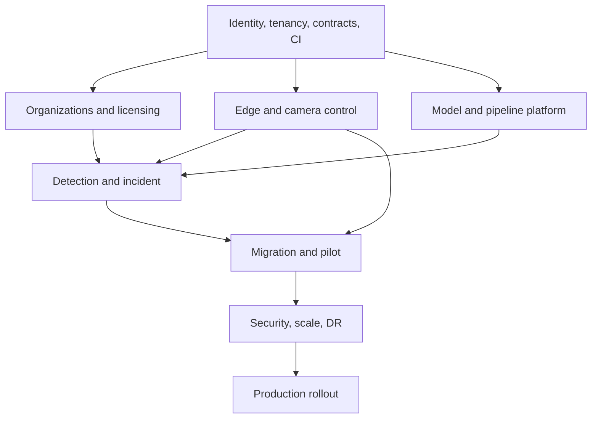

# Implementation Plan

## AIRIVU CSense Modernization

**Version:** 1.0  
**Date:** 19 August 2026  
**Planning horizon:** 44 weeks / 22 two-week sprints  
**Indicative calendar:** 1 September 2026 to 2 July 2027, subject to approval and staffing

---

## 1. Delivery Objective

Deliver a secure production version of AIRIVU CSense that preserves existing camera, edge, AI detection, and real-time alert capability while adding:

- Separate Customer CRM and Developer Console
- Strict multi-tenancy and permission controls
- Organization, reseller, licensing, and quota management
- Managed edge/camera fleet
- Versioned model and pipeline control plane
- Incident, evidence, notification, API, and audit platforms
- Enterprise observability, CI/CD, backup, recovery, and migration

The plan uses vertical slices. Each milestone must demonstrate an end-to-end user outcome, not only isolated backend or UI completion.

## 2. Delivery Strategy

### 2.1 Principles

1. Establish security, tenant context, contracts, and automation before broad feature work.
2. Keep the legacy platform available until a pilot tenant passes reconciliation and rollback checks.
3. Build edge and cloud contracts together; neither side is considered complete alone.
4. Validate AI behavior on real target hardware and representative video, not only developer machines.
5. Use Compose for development/pilot and keep services deployable to Kubernetes without making Kubernetes a release-one blocker.
6. Release behind tenant, cohort, and environment controls.
7. Every sprint includes tests, observability, migration compatibility, and documentation.

### 2.2 Release boundaries

| Release | Target | Outcome |
|---|---|---|
| Foundation | Week 8 | Secure platform skeleton, CI/CD, tenant context, stores, observability |
| Internal Alpha | Week 16 | Tenant onboarding, edge enrollment, camera discovery, live session, basic console |
| Feature MVP | Week 24 | Detection-to-incident, notifications, license enforcement, model/pipeline versioning |
| Pilot Beta | Week 32 | Real tenant migration, offline edge, reporting, support access, operational readiness |
| Production Candidate | Week 40 | Security/performance/DR gates, canary deployment, migration wave readiness |
| Production Stabilization | Week 44 | Pilot stabilized, runbooks proven, prioritized improvements completed |

## 3. Team Model

Recommended dedicated team:

| Role | Indicative allocation | Primary ownership |
|---|---:|---|
| Product Manager/Product Owner | 1 | Scope, priorities, acceptance, customer/pilot |
| Principal/Solution Architect | 1 | Architecture, contracts, decisions, integration quality |
| Engineering Manager/Delivery Lead | 1 | Delivery, staffing, dependencies, quality gates |
| Backend Engineers | 4 | Identity, tenant/admin APIs, incidents, licensing, integrations |
| Frontend Engineers | 3 | Customer CRM, Developer Console, design system |
| Edge/Media Engineers | 2 | Device agent, discovery, NVR, MediaMTX, offline sync |
| AI/ML Platform Engineers | 2 | Runtime, model registry, pipeline validation/deployment |
| DevSecOps/SRE Engineers | 2 | IaC, CI/CD, security, observability, backup/DR |
| QA Automation Engineers | 2 | API, E2E, isolation, performance, device/camera lab |
| Product Designer/UX Researcher | 1 | Research, flows, prototypes, accessible design |
| Security Engineer | 0.5–1 | Threat model, review, testing, incident readiness |
| Data/DB Engineer | 0.5–1 | Schema, migrations, performance, backup/recovery |

Minimum viable staffing can combine roles, but reducing edge, QA, security, or SRE ownership increases schedule and production risk. The plan assumes stable access to representative cameras, NVRs, edge hardware, GPU/CPU targets, and notification-provider sandboxes.

## 4. Workstreams

| Workstream | Scope |
|---|---|
| W1 Product and UX | Research, IA, prototypes, design system, usability, acceptance |
| W2 Identity and Security | Auth, MFA, sessions, permissions, tenant isolation, support grants, audit |
| W3 Core SaaS | Organizations, tenants, reseller, users, sites, licensing, quotas, reporting |
| W4 Edge, Camera, Media | Enrollment, desired state, ONVIF/NVR, DDNS compatibility, WireGuard, streaming, offline spool |
| W5 AI Platform | Model registry, validation, pipeline builder, runtime, deployment, rollback |
| W6 Incident and Notification | Detection normalization, correlation, evidence, incident workflow, escalation, webhooks |
| W7 Platform Engineering | Repositories, contracts, stores, eventing, jobs, exports |
| W8 DevSecOps and SRE | Containers, IaC, CI/CD, observability, secrets, backup, DR, release |
| W9 Migration and Pilot | Inventory, mappings, tools, reconciliation, pilot, cutover, decommission |
| W10 Quality Engineering | Test harness, device lab, isolation, security, load, resilience, E2E |

## 5. Phase Plan

### Phase 0 — Approval and Discovery

**Weeks 1–2 · Sprint 1**

Deliverables:

- Approve PRD, TRD, flows, UI/UX brief, schema, and this plan.
- Inventory legacy code, endpoints, databases, file stores, environments, credentials ownership, models, agents, cameras/NVRs, and deployment scripts.
- Create capability matrix: preserve, replace, adapt, retire, unknown.
- Confirm target countries/regions, privacy constraints, pilot tenant, use cases, camera/NVR hardware, and expected volume.
- Threat-model kickoff and data classification.
- Establish architecture decision record process and domain glossary.
- Baseline current latency, detection throughput, camera success rate, resource use, and incident behavior.

Exit gate `IMP-G0`:

- No unresolved ambiguity about final stack, tenant boundary, pilot scope, or data ownership.
- Legacy backup and rollback point confirmed.
- Product acceptance owner and security approver named.

### Phase 1 — Engineering Foundation

**Weeks 3–8 · Sprints 2–4**

Backend/platform:

- Monorepo or coordinated repositories with service ownership.
- FastAPI Admin API, Tenant API, shared backend modules, and generated OpenAPI.
- PostgreSQL, MongoDB, Redis, MinIO, MediaMTX, and Traefik local Compose.
- Migration framework, transactional outbox, event envelope, async worker skeleton.
- Correlation IDs, structured logs, tracing, metrics, health endpoints.

Security:

- Identity schema, Argon2id, customer/platform token audiences, rotating sessions.
- MFA foundation, invitations, account/session revocation.
- TenantContext and RLS proof of concept.
- Secret handling, local development secret workflow, baseline container hardening.

Frontend:

- Separate Next.js Developer Console and React/Vite Customer CRM shells.
- Shared semantic tokens/components, generated API clients, route guards, error framework.
- Accessibility and test harness.

DevOps/QA:

- CI lint, type, unit, contract, secret/dependency scan, image build/SBOM.
- Integration test stack, test data factory, first cross-tenant negative tests.
- Development and staging IaC baseline.

Exit gate `IMP-G1`:

- Two test tenants prove RLS/API/cache/object isolation.
- Customer token fails admin API and platform token has no implicit tenant access.
- One command deploys a reproducible local stack; CI blocks failing security/contract tests.

### Phase 2 — Tenant, License, and Operator Foundation

**Weeks 9–12 · Sprints 5–6**

- Organization/tenant creation and owner invitation.
- Memberships, system roles, granular permissions, site scopes.
- Reseller relationship and child tenant foundation.
- License plans, terms, entitlements, quota ledgers, concurrent reservation.
- Principal Administrator organization/license screens.
- Customer guided onboarding and tenant settings.
- Central append-only audit and search foundation.
- Step-up authentication for high-risk actions.

Vertical demonstration:

Principal Administrator creates a reseller license → reseller creates a child tenant within limits → owner enrolls MFA → child tenant sees its own empty dashboard → concurrent camera quota test prevents over-allocation.

Exit gate `IMP-G2`:

- Licensing and reseller limits pass concurrency and authorization tests.
- 100% of implemented privileged mutations produce expected audit events.

### Phase 3 — Edge, Camera, and Live Media Alpha

**Weeks 13–16 · Sprints 7–8**

Edge:

- Enrollment token, device key/certificate, heartbeat, observed/desired state.
- Signed commands, expiry, idempotency, version reporting.
- Basic update manifest and device quarantine state.

Camera:

- Site/zone/edge schemas and Customer CRM screens.
- Bounded ONVIF discovery, manual RTSP, stream profile verification.
- NVR adapter interface with one reference adapter.
- Encrypted camera credentials and credential rotation path.
- Legacy DDNS compatibility adapter design/prototype.

Media:

- MediaMTX integration, short-lived media session, WebRTC and HLS fallback.
- Camera health current state and telemetry history.
- Privacy masking/silhouette policy plumbing and masked demo stream.

Vertical demonstration:

Enroll edge → discover camera → validate sub/main stream → add camera under quota → view authorized masked stream → revoke permission/session.

Exit gate `IMP-G3` — Internal Alpha:

- Reference edge and at least three camera/NVR models pass onboarding lab tests.
- Client never receives RTSP credentials.
- Live session ends on revocation and is tenant/site scoped.

### Phase 4 — AI Registry, Pipeline Runtime, and Control Plane

**Weeks 17–20 · Sprints 9–10**

- Model family/version registry and immutable MinIO artifacts.
- Artifact digest, provenance, model card, compatibility, and validation runs.
- Pipeline schema, stage registry, versioning, allowed overrides.
- Python runtime for ingest, preprocess, inference, confidence, ROI, tracking, rules, evidence intent.
- Redis configuration cache/invalidation and desired-state deployment.
- Developer Console registry, model detail, pipeline builder, version comparison.
- Golden dataset and performance harness for initial approved use cases.

Vertical demonstration:

Upload model → validate → build pipeline → test on recorded sample → publish immutable version → assign to reference edge camera → observe runtime health.

Exit gate `IMP-G4`:

- Artifact tamper or invalid compatibility blocks activation.
- Pipeline version is reproducible from manifest and rolls back to prior version.

### Phase 5 — Incident, Evidence, and Notification MVP

**Weeks 21–24 · Sprints 11–12**

- Detection event normalization and idempotent ingestion.
- Rule correlation, cooldown, duplicate suppression, late-event policy.
- Incident state machine, timeline, comments, assignment, acknowledgement, resolution.
- Snapshot/evidence storage, masked variant, checksum, access authorization.
- Customer incident inbox/detail and real-time WebSocket update.
- Notification policy versions, recipient groups, in-app/email/webhook adapters.
- Retry, delivery status, escalation, acknowledgement cancellation.
- Initial incident and response reports.

Vertical demonstration:

Camera event → detection → correlated incident → masked evidence → WebSocket → email/webhook → user acknowledges → escalation stops → user resolves → complete timeline/audit.

Exit gate `IMP-G5` — Feature MVP:

- End-to-end event-to-UI p95 under 5 seconds at agreed MVP load.
- Duplicate/late/retried events do not create uncontrolled incident duplication.
- Evidence authorization and retention tests pass.

### Phase 6 — Resilience, APIs, Reporting, and Privileged Support

**Weeks 25–28 · Sprints 13–14**

- Edge encrypted offline spool, reconnect cursor, batch resync, deduplication.
- WireGuard/relay integration and time-limited diagnostic access.
- Support grant request, approval, active banner, expiry, revocation, audit.
- API clients, scoped API keys, rate limits, usage metering, developer documentation.
- Webhook verification, signing, delivery replay.
- SMS/web push provider adapters if contracted.
- Async reports/exports with time-limited download.
- License grace/restriction behavior and renewal flow.
- Camera health use cases: offline, obstruction, glare/night-vision, low FPS, network/storage.

Exit gate `IMP-G6`:

- Edge processes and resynchronizes after a defined offline endurance test.
- Support access cannot outlive grant and leaves complete audit evidence.
- Export and webhook paths pass tenant isolation and replay tests.

### Phase 7 — Migration Tooling and Pilot Beta

**Weeks 29–32 · Sprints 15–16**

- Legacy source inventory frozen and mapping approved.
- Idempotent migration tools for users, tenants, cameras, credentials, models, pipelines, detections/incidents as selected, and snapshots.
- Password migration or forced-reset strategy.
- Snapshot-to-MinIO digest verification.
- DDNS/edge protocol compatibility or edge upgrade package.
- Per-tenant reconciliation dashboard/report.
- Pilot runbook, installer guide, administrator training, support escalation.
- Pilot tenant dry run, rollback, then controlled cutover.
- Usability tests for incident and camera onboarding workflows.

Exit gate `IMP-G7` — Pilot Beta:

- Pilot data counts, references, digests, users, cameras, streams, alerts, and reports reconcile.
- Rollback checkpoint is usable throughout agreed window.
- No open critical defect; high defects have approved mitigation.

### Phase 8 — Production Hardening

**Weeks 33–36 · Sprints 17–18**

Security:

- Complete threat model remediation.
- SAST/SCA/secret/container/IaC/DAST gates.
- Independent penetration test and tenant isolation review.
- Key/certificate rotation exercises and security incident runbook.

Performance/resilience:

- Load, spike, endurance, queue backlog recovery, WebSocket fan-out, object storage, and media tests.
- Failure injection for Redis, worker, provider, edge disconnect, database failover/restart.
- Query/index tuning using pilot distributions.
- Capacity model and Kubernetes trigger review.

Operations:

- SLO/error-budget dashboards and on-call routing.
- Backup automation, restore exercise, RPO/RTO measurement.
- Release/canary/rollback runbooks and ownership.

Exit gate `IMP-G8`:

- Zero unresolved critical security findings.
- Performance and recovery targets pass or have explicitly approved revised targets.
- Restore in clean environment meets target and verifies checksums/references.

### Phase 9 — Production Candidate and Wave Rollout

**Weeks 37–40 · Sprints 19–20**

- Production infrastructure and DNS/TLS/secrets validated.
- Change freeze for candidate; final regression and migration rehearsal.
- Signed release manifest, SBOM, model/pipeline manifests.
- Canary tenant deployment and operational observation.
- Pilot production cutover; post-cutover reconciliation.
- Wave plan for remaining tenants/sites with go/no-go criteria.
- Commercial/license and customer support processes activated.

Exit gate `IMP-G9` — Production Candidate:

- Production acceptance criteria in PRD are signed off.
- Canary stays within error budgets for agreed observation period.
- Business, product, security, engineering, and operations approve rollout.

### Phase 10 — Stabilization and Handover

**Weeks 41–44 · Sprints 21–22**

- Resolve pilot defects and tuning requests by severity.
- Tune false-positive/correlation thresholds under governed pipeline versions.
- Validate notification delivery and customer response workflows.
- Complete support knowledge base, admin manual, operator manual, API guide, and incident runbooks.
- Conduct operations handover and access review.
- Decommission eligible legacy components only after retention and rollback obligations end.
- Produce post-implementation review and next roadmap.

Exit gate `IMP-G10`:

- Stable SLO trend, accepted defect backlog, trained support/operations, and completed access review.
- Legacy services are either documented as retained dependencies or safely decommissioned.

## 6. Sprint-Level Milestone Map

| Sprint | Weeks | Primary increment |
|---:|---:|---|
| 1 | 1–2 | Discovery, inventory, baselines, approvals |
| 2 | 3–4 | Repo, APIs, stores, Compose, CI skeleton |
| 3 | 5–6 | Identity, sessions, tenant context, RLS |
| 4 | 7–8 | UI shells, outbox, observability, isolation gate |
| 5 | 9–10 | Organizations, users, roles, audit |
| 6 | 11–12 | Reseller, license, quota, onboarding |
| 7 | 13–14 | Edge enrollment, heartbeat, sites, discovery |
| 8 | 15–16 | Camera profiles, MediaMTX, live privacy stream |
| 9 | 17–18 | Model registry and validation |
| 10 | 19–20 | Pipeline builder, runtime, assignment, rollback |
| 11 | 21–22 | Detection ingestion, incident/evidence |
| 12 | 23–24 | Notification/escalation, incident UX, MVP gate |
| 13 | 25–26 | Offline spool, resync, support grants |
| 14 | 27–28 | APIs/webhooks, exports, health use cases |
| 15 | 29–30 | Migration tools, reconciliation, pilot rehearsal |
| 16 | 31–32 | Pilot cutover, usability, beta gate |
| 17 | 33–34 | Security hardening and penetration testing |
| 18 | 35–36 | Load, resilience, restore, capacity |
| 19 | 37–38 | Production infrastructure and final regression |
| 20 | 39–40 | Canary and production candidate |
| 21 | 41–42 | Stabilization, AI/notification tuning |
| 22 | 43–44 | Handover, decommission decision, roadmap |

## 7. Critical Dependencies

Dependency rules:

- Incident work may prototype early, but production integration depends on stable tenant/event/evidence contracts.
- AI control plane depends on object storage, signing/digest, edge desired state, and test harness.
- Pilot migration cannot begin until source mapping and retention decisions are approved.
- Production cannot proceed without restore proof, tenant isolation, security sign-off, and on-call readiness.

## 8. Environments and Promotion

| Environment | Purpose | Data rule |
|---|---|---|
| Local | Individual development | Synthetic only |
| Integration | Automated service/contract/E2E | Generated test data |
| AI Lab | Recorded samples and hardware profiling | Approved de-identified/controlled datasets |
| Staging | Production-like release validation | Synthetic or approved masked subset |
| Pilot | Controlled real customer operation | Contracted tenant data |
| Production | Live service | Strict access, residency, retention, audit |

Promotion is artifact-based. Code images, model artifacts, pipeline definitions, migrations, and configuration have immutable versions. Rebuilding a different artifact under the same version is prohibited.

## 9. Engineering Quality Gates

### Pull request

- Linked requirement/story and acceptance criteria
- Code review and ownership approval
- Lint/type/unit/contract tests
- Secret, dependency, license, and SAST scan
- Migration backward-compatibility review where applicable
- Telemetry and error behavior included
- No uncontrolled tenant ID from client input

### Release candidate

- Full integration and E2E
- Tenant isolation suite
- API backward compatibility
- AI golden dataset and resource benchmarks
- Camera/NVR certification regression
- Security scans and DAST
- Load/smoke and failure recovery
- Backup/migration dry run
- UX accessibility regression
- Runbook and rollback verified

### Production

- Change owner, approver, window, communications, and on-call named
- Canary target and guardrails set
- Dashboards/alerts live
- No destructive incompatible migration
- Signed artifact manifest and SBOM
- Post-deploy smoke and business flow verification

## 10. Test Matrix

| Test category | Minimum release-one coverage |
|---|---|
| Unit | Domain rules, permissions, quota, incident state, pipeline validation, provider adapters |
| Contract | OpenAPI request/response, events, edge protocol, provider interfaces |
| Integration | PostgreSQL/Mongo/Redis/MinIO, outbox, jobs, media authorization |
| Tenant isolation | APIs, SQL RLS, Mongo wrappers, Redis, WebSockets, objects, search, exports |
| Edge | Enrollment, rotation, revocation, desired state, offline spool, late events, updates |
| Camera/NVR | Discovery, authentication, codecs, profiles, reconnect, clock, vendor matrix |
| AI | Golden datasets, accuracy thresholds, malformed input, CPU/GPU, canary, rollback |
| Incident | Correlation, cooldown, race, idempotency, evidence, retention, state history |
| Notification | Scheduling, retries, provider failures, acknowledgement, webhook signing/replay |
| Security | Auth abuse, MFA, IDOR, SSRF, upload, injection, CSRF, CORS, session replay, privilege |
| Performance | API, ingestion, queues, WebSockets, media relay, object storage, endurance |
| Recovery | Backup restore, service restart, queue backlog, edge reconnect, rollback |
| Accessibility | Keyboard, focus, screen reader, contrast, zoom, live updates |

## 11. Migration Execution Plan

### 11.1 Preparation

- Read-only export of legacy MongoDB/SQLite and snapshot inventory.
- Generate source-to-target mapping and tenant ownership report.
- Identify orphan cameras, missing tenants, duplicate users, weak/plaintext passwords, missing evidence, invalid RTSP endpoints, and unknown model versions.
- Agree disposition for each exception.

### 11.2 Dry run

- Import into isolated environment with idempotent batch ID.
- Compare row/document/object counts, checksums, relationships, status, and sample UI behavior.
- Test login/reset, live view, detection, incident, report, and retention.
- Record runtime and downtime estimate.

### 11.3 Cutover

1. Confirm go/no-go and rollback checkpoint.
2. Freeze relevant legacy mutations.
3. Take final incremental export/backup.
4. Run import with mappings and reconciliation.
5. Rotate/import secrets through approved encryption path.
6. Switch edge/agents or compatibility endpoints.
7. Validate health, cameras, streams, pipeline assignments, alerts, evidence, users, and licenses.
8. Route traffic to new platform.
9. Monitor canary window and obtain tenant sign-off.

### 11.4 Rollback

- Trigger on critical security/isolation defect, unacceptable data reconciliation, sustained incident-path failure, or agreed SLO breach.
- Stop new platform mutations safely, export post-cutover changes if recoverable, restore routing/edge endpoint, and verify legacy service.
- Do not destroy new data during rollback; preserve for reconciliation and audit.

### 11.5 Decommission

Legacy shutdown occurs only after rollback period, data retention, audit export, credential rotation, DNS/tunnel cleanup, snapshot verification, and business approval.

## 12. Operational Readiness Checklist

- Service ownership and escalation matrix
- SLOs, dashboards, alerts, and error budgets
- Customer incident and security incident runbooks
- Edge/camera troubleshooting and vendor matrix
- Notification-provider failure and failover runbook
- Backup, restore, and data corruption runbook
- License expiry and quota-support procedure
- Model/pipeline rollback procedure
- Support grant and emergency access procedure
- Deployment/canary/rollback runbook
- Capacity plan and scale thresholds
- Status communication templates
- Data retention/deletion/legal-hold operations
- Monthly access review and quarterly restore test schedule

## 13. Risks and Mitigations

| Risk | Probability/impact | Mitigation | Owner |
|---|---|---|---|
| Legacy source is incomplete or inconsistent | High/High | Early inventory, mapping, dry runs, explicit exception log | Migration Lead |
| Camera/NVR incompatibility | High/High | Certification lab, adapter interface, vendor matrix, pilot hardware | Edge Lead |
| False positives delay customer acceptance | Medium/High | Observe-only, golden data, governed tuning, correlation/cooldown | AI/Product |
| Cross-tenant defect | Low/Severe | RLS, separate repositories, negative tests, independent review | Security/Backend |
| Edge update bricks devices | Medium/High | A/B or rollback update, cohorts, health guardrail, signed manifest | Edge/SRE |
| Multi-store inconsistency | Medium/High | Outbox, idempotency, reconciliation, defined source of truth | Architect/Data |
| Scope growth in Developer Console | High/Medium | Release boundaries, role-based backlog, prioritize operational loops | Product |
| Kubernetes introduced too early | Medium/Medium | Compose pilot, documented adoption trigger | SRE/Architect |
| Notification provider unreliability | Medium/High | Adapter isolation, retry/fallback, clear provider vs platform SLA | Backend/SRE |
| Insufficient target hardware | Medium/High | Procure/lab in Phase 0; benchmark before commitments | Delivery/AI |
| Privacy approval delays | Medium/High | Early data classification, masking by default, country/sector review | Product/Legal |
| Team fragmentation across stacks | Medium/Medium | Approved stack, shared contracts, owners, ADR for additions | Engineering Lead |

## 14. Scope Control

Change requests are classified:

- **Class A:** clarification within approved requirement; Product Owner approves.
- **Class B:** feature/schedule change without architecture/security impact; Product + Delivery approve and replan.
- **Class C:** tenant boundary, identity, data store, edge protocol, model governance, or production architecture change; Architecture and Security review required.
- **Class D:** regulatory, contractual, or safety-critical change; Executive/Product/Legal/Security approval required.

Any added release-one scope must identify the item removed, added staffing, or schedule impact.

## 15. Definition of Ready

A story is ready when:

- User/business outcome and role are clear.
- Requirement ID and acceptance criteria exist.
- Tenant, permission, license, audit, privacy, and failure behavior are identified.
- API/event/schema/design dependencies are resolved or explicitly stubbed.
- Test data and environment needs are available.
- Operational telemetry and rollout control are defined.

## 16. Definition of Done

A feature is done only when:

- Code, database migration, API/event contracts, and UI are complete as applicable.
- Unit, integration, E2E, tenant isolation, and security tests pass.
- Accessibility and responsive states pass for relevant UI.
- Metrics, structured logs, traces, alerts, and correlation IDs are included.
- Audit events and redaction are verified.
- Documentation, runbook, and generated API references are updated.
- Migration/backward compatibility and rollback are proven.
- Product Owner accepts the defined user outcome in a deployed environment.

## 17. Governance and Review Cadence

| Cadence | Review |
|---|---|
| Daily | Delivery blockers and operational issues |
| Weekly | Product/engineering dependency and risk review |
| Per sprint | Demo, acceptance, retrospective, security/architecture delta |
| Fortnightly | AI validation and camera certification review |
| Monthly | Executive milestone, budget/staffing, privacy/security, pilot readiness |
| Before every production change | Go/no-go, rollback, on-call, observability |
| Quarterly after launch | Access review, restore test, dependency/model review, capacity plan |

## 18. Immediate Next Actions

Within five working days of approval:

1. Name Product Owner, Architect, Delivery Lead, Security Approver, and pilot customer owner.
2. Confirm team allocation and close critical hiring/contract gaps.
3. Create the legacy inventory and camera/NVR/edge hardware lab list.
4. Approve release-one use cases and privacy classifications.
5. Establish repositories, environments, issue taxonomy, ADRs, and Definition of Done.
6. Conduct threat-model and data-classification workshops.
7. Convert Phase 1 into sprint tickets linked to PRD requirement IDs.
8. Agree pilot success metrics, cutover window, and rollback obligations.

